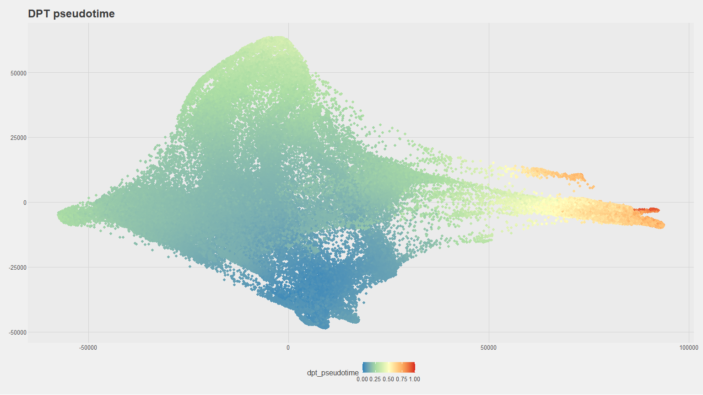

***
# Test plots for oligo project


## UMAP plots 
### Figure 1
#### UMAP colored by cluster.
<!-- -->

### Figure 2
#### UMAP colored by condition.
<!-- -->

#### Heatmap
#### GSEA - heatmap
#### Microglia / macrophage differences
#### QC

### Figure 3. 
#### Box plot of all clusters divided by condition. Include statistical comparison information.

```
## Performing logit transformation of proportions
```

```
## group variable has > 2 levels, ANOVA will be performed
```

<!-- -->

***

## Tumor only
### Figure 4. 
#### UMAP. Reclustering of only tumor cell clusters. Colored by cluster ID.
<!-- -->

### Split by condition - re-integrated

```
## [[1]]
```

<!-- -->

```
## 
## [[2]]
```

<!-- -->

```
## 
## [[3]]
```

<!-- -->

```
## 
## [[4]]
```

<!-- -->

### Alternative dimension reduction - ForceAtlas2
<!-- -->


## Trajectory inference using PAGA and DPT
### Figure 5. 
#### Pseudotime trajectory analysis of above tumor cell clustering (to define undifferentiated vs differentiated clusters).
<!-- -->

<!-- -->


### Figure 6. 
#### Box plot of tumor cell clusters only divided by condition. Include statistical comparison information.

```
## Performing logit transformation of proportions
```

```
## group variable has > 2 levels, ANOVA will be performed
```

<!-- -->

***
## Heatmap
### By cell


### By cluster
#### Scaled - restrict to just tumor clusters for main figure; can have all for supplemental
<!-- -->

#### Midpoint 0
<!-- -->

***

## GSEA


Built with R 4.5.2.
