***
# Test plots for oligo project


## UMAP plots 
### Figure 1
#### UMAP colored by cluster.
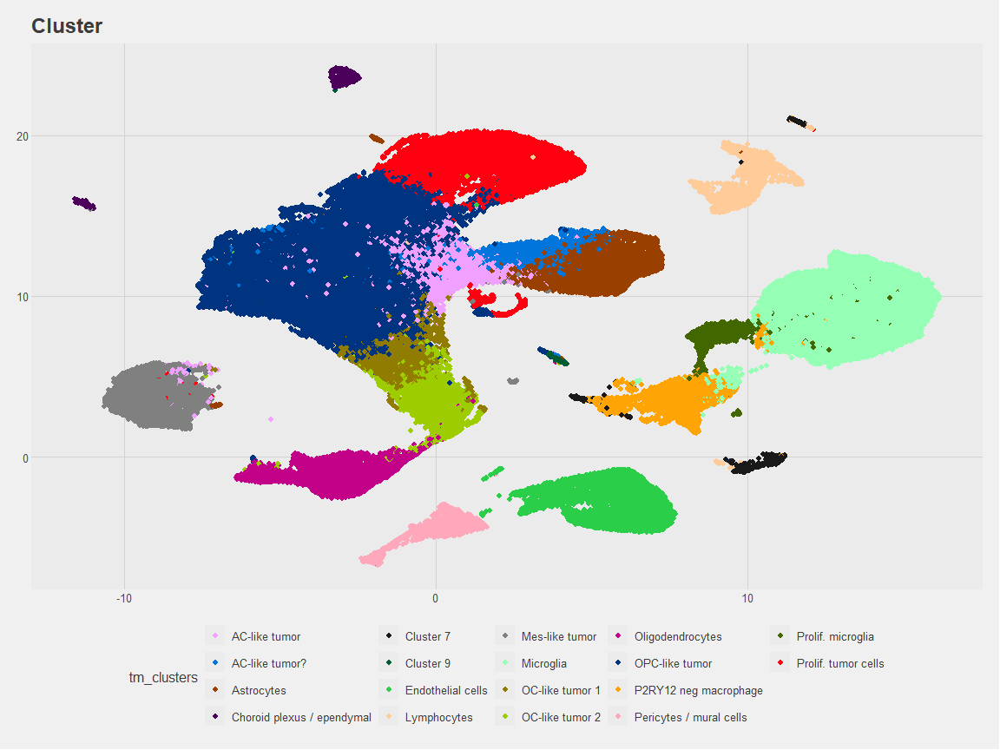<!-- -->

### Figure 2
#### UMAP colored by condition.
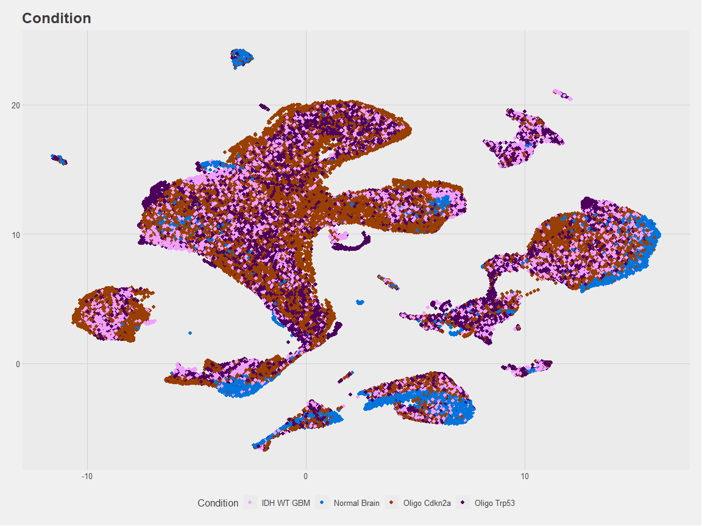<!-- -->

### Figure 3. 
#### Box plot of all clusters divided by condition. Include statistical comparison information.

```
## Performing logit transformation of proportions
```

```
## group variable has > 2 levels, ANOVA will be performed
```

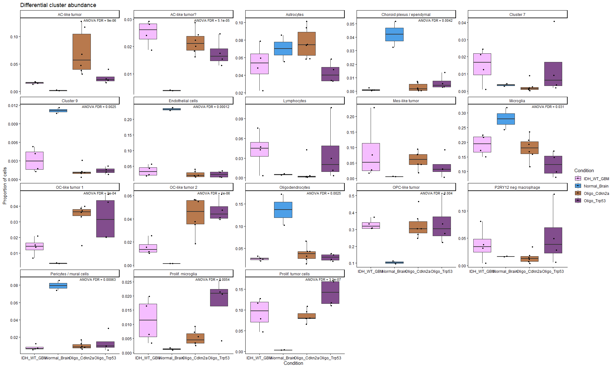<!-- -->

***

## Tumor only
### Figure 4. 
#### UMAP. Reclustering of only tumor cell clusters. Colored by cluster ID.
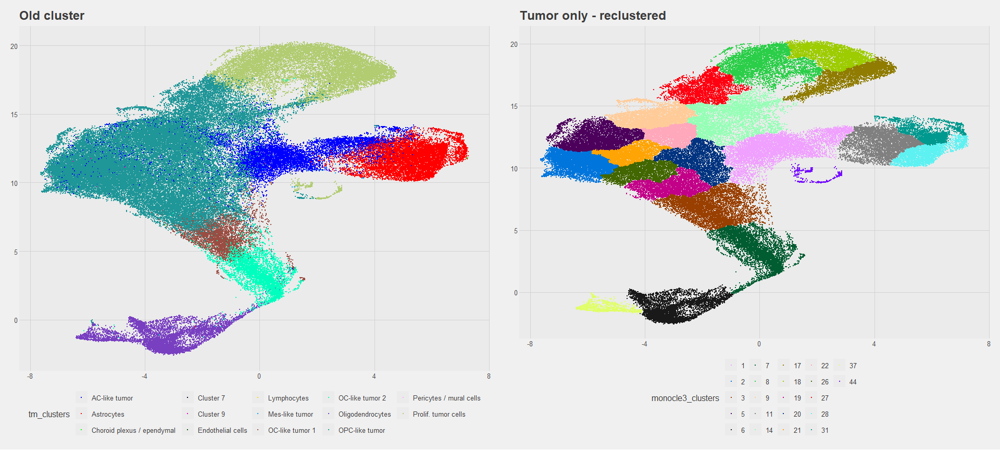<!-- -->

### Split by condition 

```
## $Oligo_Cdkn2a
```

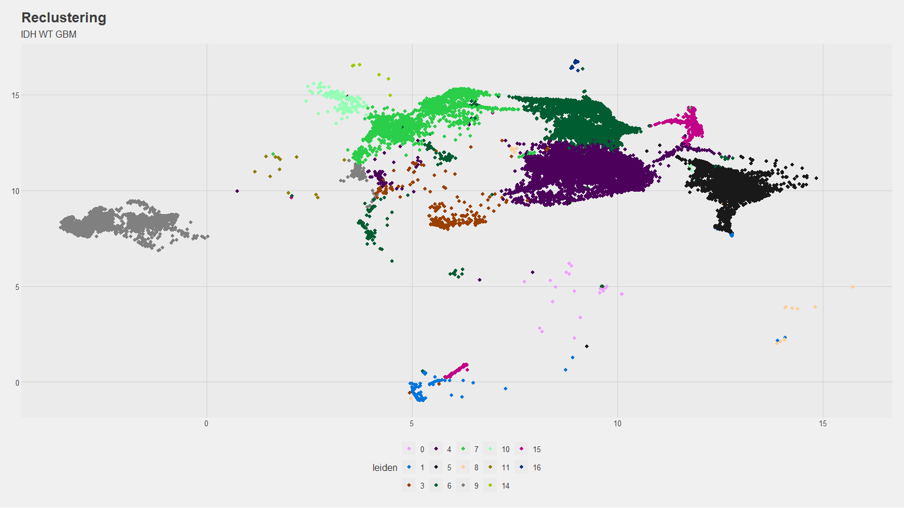<!-- -->

```
## 
## $IDH_WT_GBM
```

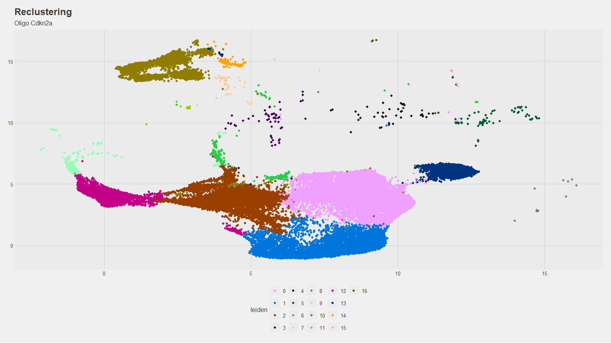<!-- -->

```
## 
## $Oligo_Trp53
```

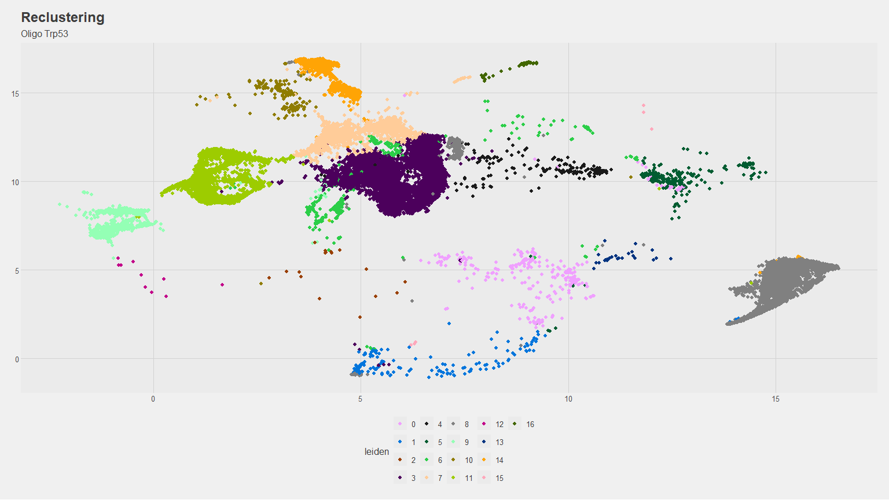<!-- -->

```
## 
## $Normal_Brain
```

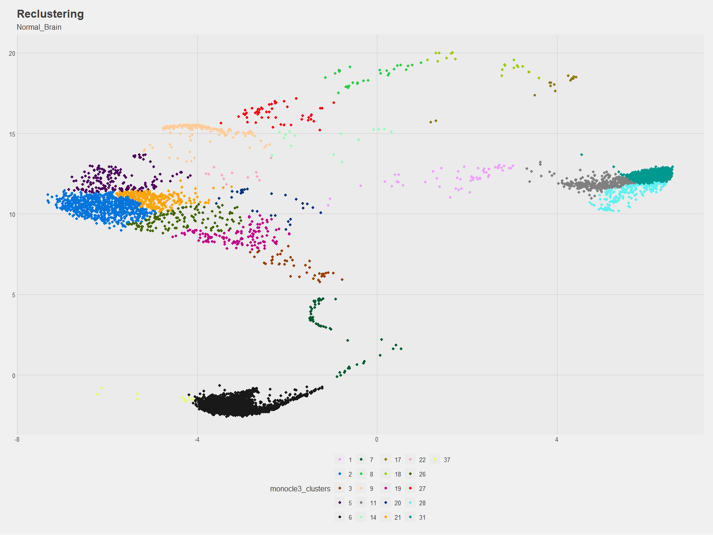<!-- -->

## Trajectory inference using Monocle3
### Figure 5. 
#### Pseudotime trajectory analysis of above tumor cell clustering (to define undifferentiated vs differentiated clusters).
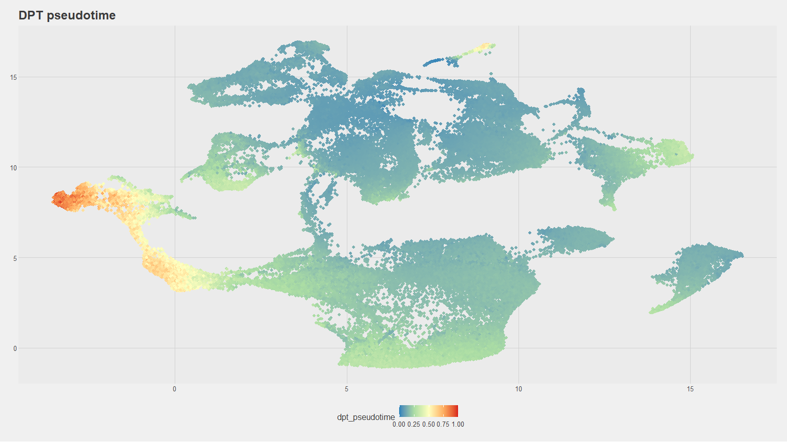<!-- -->

#### Differential expression as a function of pseudotime

### Figure 6. 
#### Box plot of tumor cell clusters only divided by condition. Include statistical comparison information.

```
## Performing logit transformation of proportions
```

```
## group variable has > 2 levels, ANOVA will be performed
```

<!-- -->

***
## Heatmap
### By cell

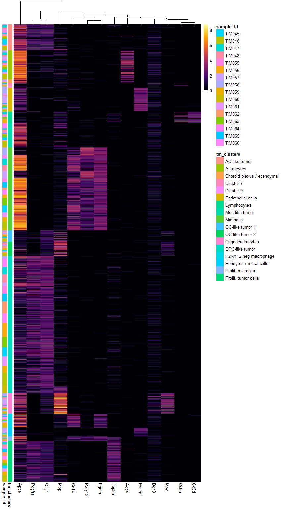<!-- -->

### By cluster
#### Scaled
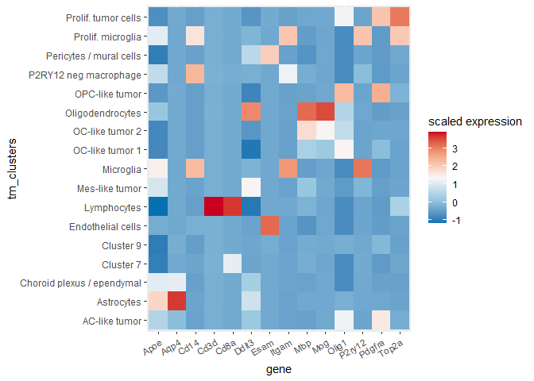<!-- -->

#### Midpoint 0
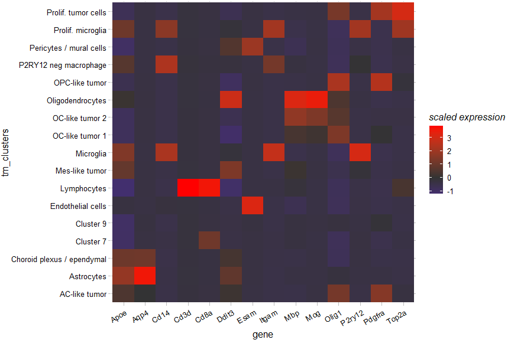<!-- -->

***

## GSEA


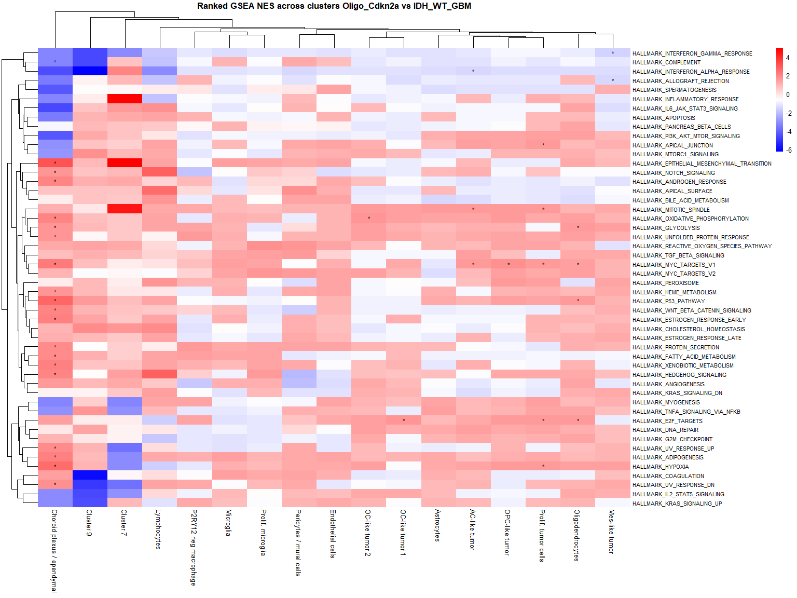<!-- -->

#### Microglia / macrophage differences
#### Trailmaker QC settings

```
##               X.1.classifier.TIM055_sample_filtered_feature_bc_matrix.
## 1                                                           FDR = 0.01
## 2              [1-classifier.TIM056_sample_filtered_feature_bc_matrix]
## 3                                                           FDR = 0.01
## 4              [1-classifier.TIM057_sample_filtered_feature_bc_matrix]
## 5                                                           FDR = 0.01
## 6              [1-classifier.TIM058_sample_filtered_feature_bc_matrix]
## 7                                                           FDR = 0.01
## 8              [1-classifier.TIM059_sample_filtered_feature_bc_matrix]
## 9                                                           FDR = 0.01
## 10             [1-classifier.TIM060_sample_filtered_feature_bc_matrix]
## 11                                                          FDR = 0.01
## 12             [1-classifier.TIM061_sample_filtered_feature_bc_matrix]
## 13                                                          FDR = 0.01
## 14             [1-classifier.TIM062_sample_filtered_feature_bc_matrix]
## 15                                                          FDR = 0.01
## 16             [1-classifier.TIM063_sample_filtered_feature_bc_matrix]
## 17                                                          FDR = 0.01
## 18             [1-classifier.TIM064_sample_filtered_feature_bc_matrix]
## 19                                                          FDR = 0.01
## 20             [1-classifier.TIM065_sample_filtered_feature_bc_matrix]
## 21                                                          FDR = 0.01
## 22             [1-classifier.TIM066_sample_filtered_feature_bc_matrix]
## 23                                                          FDR = 0.01
## 24            [1-classifier.TIM045X_sample_filtered_feature_bc_matrix]
## 25                                                          FDR = 0.01
## 26            [1-classifier.TIM046X_sample_filtered_feature_bc_matrix]
## 27                                                          FDR = 0.01
## 28            [1-classifier.TIM047X_sample_filtered_feature_bc_matrix]
## 29                                                          FDR = 0.01
## 30            [1-classifier.TIM048X_sample_filtered_feature_bc_matrix]
## 31                                                          FDR = 0.01
## 32   [2-cellSizeDistribution.TIM055_sample_filtered_feature_bc_matrix]
## 33                                                       binStep = 200
## 34                                                 minCellSize = 91892
## 35   [2-cellSizeDistribution.TIM056_sample_filtered_feature_bc_matrix]
## 36                                                       binStep = 200
## 37                                                 minCellSize = 88852
## 38   [2-cellSizeDistribution.TIM057_sample_filtered_feature_bc_matrix]
## 39                                                       binStep = 200
## 40                                                 minCellSize = 52661
## 41   [2-cellSizeDistribution.TIM058_sample_filtered_feature_bc_matrix]
## 42                                                       binStep = 200
## 43                                                 minCellSize = 53079
## 44   [2-cellSizeDistribution.TIM059_sample_filtered_feature_bc_matrix]
## 45                                                       binStep = 200
## 46                                                minCellSize = 151633
## 47   [2-cellSizeDistribution.TIM060_sample_filtered_feature_bc_matrix]
## 48                                                       binStep = 200
## 49                                                minCellSize = 197965
## 50   [2-cellSizeDistribution.TIM061_sample_filtered_feature_bc_matrix]
## 51                                                       binStep = 200
## 52                                                 minCellSize = 81950
## 53   [2-cellSizeDistribution.TIM062_sample_filtered_feature_bc_matrix]
## 54                                                       binStep = 200
## 55                                                 minCellSize = 81265
## 56   [2-cellSizeDistribution.TIM063_sample_filtered_feature_bc_matrix]
## 57                                                       binStep = 200
## 58                                                 minCellSize = 98004
## 59   [2-cellSizeDistribution.TIM064_sample_filtered_feature_bc_matrix]
## 60                                                       binStep = 200
## 61                                                 minCellSize = 60287
## 62   [2-cellSizeDistribution.TIM065_sample_filtered_feature_bc_matrix]
## 63                                                       binStep = 200
## 64                                                 minCellSize = 96917
## 65   [2-cellSizeDistribution.TIM066_sample_filtered_feature_bc_matrix]
## 66                                                       binStep = 200
## 67                                                 minCellSize = 88152
## 68  [2-cellSizeDistribution.TIM045X_sample_filtered_feature_bc_matrix]
## 69                                                       binStep = 200
## 70                                                 minCellSize = 72052
## 71  [2-cellSizeDistribution.TIM046X_sample_filtered_feature_bc_matrix]
## 72                                                       binStep = 200
## 73                                                 minCellSize = 75486
## 74  [2-cellSizeDistribution.TIM047X_sample_filtered_feature_bc_matrix]
## 75                                                       binStep = 200
## 76                                                 minCellSize = 61277
## 77  [2-cellSizeDistribution.TIM048X_sample_filtered_feature_bc_matrix]
## 78                                                       binStep = 200
## 79                                                 minCellSize = 74047
## 80   [3-mitochondrialContent.TIM055_sample_filtered_feature_bc_matrix]
## 81                                          method = absoluteThreshold
## 82                                                       binStep = 0.3
## 83                                           maxFraction = 0.005938702
## 84   [3-mitochondrialContent.TIM056_sample_filtered_feature_bc_matrix]
## 85                                          method = absoluteThreshold
## 86                                                       binStep = 0.3
## 87                                           maxFraction = 0.005417118
## 88   [3-mitochondrialContent.TIM057_sample_filtered_feature_bc_matrix]
## 89                                          method = absoluteThreshold
## 90                                                       binStep = 0.3
## 91                                            maxFraction = 0.01593528
## 92   [3-mitochondrialContent.TIM058_sample_filtered_feature_bc_matrix]
## 93                                          method = absoluteThreshold
## 94                                                       binStep = 0.3
## 95                                            maxFraction = 0.01356374
## 96   [3-mitochondrialContent.TIM059_sample_filtered_feature_bc_matrix]
## 97                                          method = absoluteThreshold
## 98                                                       binStep = 0.3
## 99                                           maxFraction = 0.005409603
## 100  [3-mitochondrialContent.TIM060_sample_filtered_feature_bc_matrix]
## 101                                         method = absoluteThreshold
## 102                                                      binStep = 0.3
## 103                                          maxFraction = 0.005328189
## 104  [3-mitochondrialContent.TIM061_sample_filtered_feature_bc_matrix]
## 105                                         method = absoluteThreshold
## 106                                                      binStep = 0.3
## 107                                          maxFraction = 0.005609059
## 108  [3-mitochondrialContent.TIM062_sample_filtered_feature_bc_matrix]
## 109                                         method = absoluteThreshold
## 110                                                      binStep = 0.3
## 111                                          maxFraction = 0.005952935
## 112  [3-mitochondrialContent.TIM063_sample_filtered_feature_bc_matrix]
## 113                                         method = absoluteThreshold
## 114                                                      binStep = 0.3
## 115                                           maxFraction = 0.00520047
## 116  [3-mitochondrialContent.TIM064_sample_filtered_feature_bc_matrix]
## 117                                         method = absoluteThreshold
## 118                                                      binStep = 0.3
## 119                                          maxFraction = 0.005415162
## 120  [3-mitochondrialContent.TIM065_sample_filtered_feature_bc_matrix]
## 121                                         method = absoluteThreshold
## 122                                                      binStep = 0.3
## 123                                          maxFraction = 0.005557575
## 124  [3-mitochondrialContent.TIM066_sample_filtered_feature_bc_matrix]
## 125                                         method = absoluteThreshold
## 126                                                      binStep = 0.3
## 127                                          maxFraction = 0.005331363
## 128 [3-mitochondrialContent.TIM045X_sample_filtered_feature_bc_matrix]
## 129                                         method = absoluteThreshold
## 130                                                      binStep = 0.3
## 131                                          maxFraction = 0.006008584
## 132 [3-mitochondrialContent.TIM046X_sample_filtered_feature_bc_matrix]
## 133                                         method = absoluteThreshold
## 134                                                      binStep = 0.3
## 135                                          maxFraction = 0.005730428
## 136 [3-mitochondrialContent.TIM047X_sample_filtered_feature_bc_matrix]
## 137                                         method = absoluteThreshold
## 138                                                      binStep = 0.3
## 139                                          maxFraction = 0.005298013
## 140 [3-mitochondrialContent.TIM048X_sample_filtered_feature_bc_matrix]
## 141                                         method = absoluteThreshold
## 142                                                      binStep = 0.3
## 143                                          maxFraction = 0.005293246
## 144     [4-numGenesVsNumUmis.TIM055_sample_filtered_feature_bc_matrix]
## 145                                            regressionType = spline
## 146                                             p.level = 0.0001132759
## 147     [4-numGenesVsNumUmis.TIM056_sample_filtered_feature_bc_matrix]
## 148                                            regressionType = spline
## 149                                            p.level = 0.00009344048
## 150     [4-numGenesVsNumUmis.TIM057_sample_filtered_feature_bc_matrix]
## 151                                            regressionType = spline
## 152                                            p.level = 0.00009119927
## 153     [4-numGenesVsNumUmis.TIM058_sample_filtered_feature_bc_matrix]
## 154                                            regressionType = spline
## 155                                              p.level = 0.000114771
## 156     [4-numGenesVsNumUmis.TIM059_sample_filtered_feature_bc_matrix]
## 157                                            regressionType = spline
## 158                                            p.level = 0.00008873114
## 159     [4-numGenesVsNumUmis.TIM060_sample_filtered_feature_bc_matrix]
## 160                                            regressionType = spline
## 161                                             p.level = 0.0001004823
## 162     [4-numGenesVsNumUmis.TIM061_sample_filtered_feature_bc_matrix]
## 163                                            regressionType = spline
## 164                                                    p.level = 0.001
## 165     [4-numGenesVsNumUmis.TIM062_sample_filtered_feature_bc_matrix]
## 166                                            regressionType = spline
## 167                                             p.level = 0.0001129944
## 168     [4-numGenesVsNumUmis.TIM063_sample_filtered_feature_bc_matrix]
## 169                                            regressionType = spline
## 170                                            p.level = 0.00008002561
## 171     [4-numGenesVsNumUmis.TIM064_sample_filtered_feature_bc_matrix]
## 172                                            regressionType = spline
## 173                                             p.level = 0.0001237777
## 174     [4-numGenesVsNumUmis.TIM065_sample_filtered_feature_bc_matrix]
## 175                                            regressionType = spline
## 176                                             p.level = 0.0001085187
## 177     [4-numGenesVsNumUmis.TIM066_sample_filtered_feature_bc_matrix]
## 178                                            regressionType = spline
## 179                                            p.level = 0.00009521996
## 180    [4-numGenesVsNumUmis.TIM045X_sample_filtered_feature_bc_matrix]
## 181                                            regressionType = spline
## 182                                            p.level = 0.00007392076
## 183    [4-numGenesVsNumUmis.TIM046X_sample_filtered_feature_bc_matrix]
## 184                                            regressionType = spline
## 185                                            p.level = 0.00007785737
## 186    [4-numGenesVsNumUmis.TIM047X_sample_filtered_feature_bc_matrix]
## 187                                            regressionType = spline
## 188                                              p.level = 0.000101688
## 189    [4-numGenesVsNumUmis.TIM048X_sample_filtered_feature_bc_matrix]
## 190                                            regressionType = spline
## 191                                             p.level = 0.0001007252
## 192         [5-doubletScores.TIM055_sample_filtered_feature_bc_matrix]
## 193                                                     binStep = 0.02
## 194                                   probabilityThreshold = 0.4450093
## 195         [5-doubletScores.TIM056_sample_filtered_feature_bc_matrix]
## 196                                                     binStep = 0.02
## 197                                   probabilityThreshold = 0.4237304
## 198         [5-doubletScores.TIM057_sample_filtered_feature_bc_matrix]
## 199                                                     binStep = 0.02
## 200                                   probabilityThreshold = 0.4759446
## 201         [5-doubletScores.TIM058_sample_filtered_feature_bc_matrix]
## 202                                                     binStep = 0.02
## 203                                   probabilityThreshold = 0.4521705
## 204         [5-doubletScores.TIM059_sample_filtered_feature_bc_matrix]
## 205                                                     binStep = 0.02
## 206                                   probabilityThreshold = 0.4872152
## 207         [5-doubletScores.TIM060_sample_filtered_feature_bc_matrix]
## 208                                                     binStep = 0.02
## 209                                   probabilityThreshold = 0.3814495
## 210         [5-doubletScores.TIM061_sample_filtered_feature_bc_matrix]
## 211                                                     binStep = 0.02
## 212                                   probabilityThreshold = 0.3727773
## 213         [5-doubletScores.TIM062_sample_filtered_feature_bc_matrix]
## 214                                                     binStep = 0.02
## 215                                   probabilityThreshold = 0.3910435
## 216         [5-doubletScores.TIM063_sample_filtered_feature_bc_matrix]
## 217                                                     binStep = 0.02
## 218                                   probabilityThreshold = 0.4747944
## 219         [5-doubletScores.TIM064_sample_filtered_feature_bc_matrix]
## 220                                                     binStep = 0.02
## 221                                   probabilityThreshold = 0.4484248
## 222         [5-doubletScores.TIM065_sample_filtered_feature_bc_matrix]
## 223                                                     binStep = 0.02
## 224                                   probabilityThreshold = 0.3973176
## 225         [5-doubletScores.TIM066_sample_filtered_feature_bc_matrix]
## 226                                                     binStep = 0.02
## 227                                   probabilityThreshold = 0.4022901
## 228        [5-doubletScores.TIM045X_sample_filtered_feature_bc_matrix]
## 229                                                     binStep = 0.02
## 230                                   probabilityThreshold = 0.3469654
## 231        [5-doubletScores.TIM046X_sample_filtered_feature_bc_matrix]
## 232                                                     binStep = 0.02
## 233                                   probabilityThreshold = 0.4371886
## 234        [5-doubletScores.TIM047X_sample_filtered_feature_bc_matrix]
## 235                                                     binStep = 0.02
## 236                                    probabilityThreshold = 0.441427
## 237        [5-doubletScores.TIM048X_sample_filtered_feature_bc_matrix]
## 238                                                     binStep = 0.02
## 239                                   probabilityThreshold = 0.4360736
## 240                                                [6-dataIntegration]
## 241                                              analysisTool = scanpy
## 242                                [6-dataIntegration.dataIntegration]
## 243                                                   method = harmony
## 244                                                    numGenes = 2000
## 245                                       normalisation = logNormalize
## 246                        [6-dataIntegration.dimensionalityReduction]
## 247                                                      method = rpca
## 248                                                        numPCs = 30
## 249                           [7-configureEmbedding.embeddingSettings]
## 250                                                      method = umap
## 251                                            distanceMetric = cosine
## 252                                              minimumDistance = 0.3
## 253                          [7-configureEmbedding.clusteringSettings]
## 254                                                    method = leiden
## 255                                                   resolution = 0.8
```

Built with R 4.5.2.
