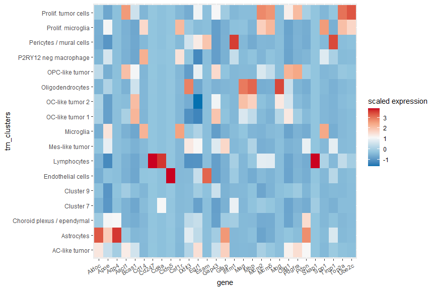

***
# Test plots for oligo project


## UMAP plots 
### Figure 1
#### UMAP colored by cluster.
<!-- -->

### Figure 2
#### UMAP colored by condition.
<!-- -->

### Figure 3. 
#### Box plot of all clusters divided by condition. Include statistical comparison information.

```
## Performing logit transformation of proportions
```

```
## group variable has > 2 levels, ANOVA will be performed
```

<!-- -->

***

## Tumor only
### Figure 4. 
#### UMAP. Reclustering of only tumor cell clusters. Colored by cluster ID.
<!-- -->

### Split by condition 


## Trajectory inference using Monocle3
### Figure 5. 
#### Pseudotime trajectory analysis of above tumor cell clustering (to define undifferentiated vs differentiated clusters).
<!-- -->

#### Differential expression as a function of pseudotime
##### Used genes with q value < 0.01 differential expression analysis (total n = 14,037) - can use others
<!-- -->

### Figure 6. 
#### Box plot of tumor cell clusters only divided by condition. Include statistical comparison information.

```
## Performing logit transformation of proportions
```

```
## group variable has > 2 levels, ANOVA will be performed
```

<!-- -->

***
## Heatmap
### By cell

<!-- -->

### By cluster
#### Scaled
<!-- -->

#### pheatmap - adds hierarchical clustering

<!-- -->
#### Midpoint 0
<!-- -->

***

## GSEA


<!-- -->

#### Microglia / macrophage differences
##### Oligo Cdkn2a vs normal brain

```
## $plot
```

<!-- -->

```
## 
## $output
##                                        pathway        NES      padj cell_type
##                                         <char>      <num>     <num>    <char>
##  1:                      HALLMARK_ADIPOGENESIS  1.3385265 0.1793299 Microglia
##  2:               HALLMARK_ALLOGRAFT_REJECTION  1.3733766 0.1793299 Microglia
##  3:                 HALLMARK_ANDROGEN_RESPONSE -0.9367165 0.7026116 Microglia
##  4:                      HALLMARK_ANGIOGENESIS  1.1552920 0.5459402 Microglia
##  5:                   HALLMARK_APICAL_JUNCTION  0.9468957 0.7026116 Microglia
##  6:                    HALLMARK_APICAL_SURFACE  1.2687545 0.2635533 Microglia
##  7:                         HALLMARK_APOPTOSIS  1.0306536 0.5726281 Microglia
##  8:              HALLMARK_BILE_ACID_METABOLISM  1.0477967 0.5644469 Microglia
##  9:           HALLMARK_CHOLESTEROL_HOMEOSTASIS  1.3422520 0.2202247 Microglia
## 10:                       HALLMARK_COAGULATION  1.2956285 0.2521368 Microglia
## 11:                        HALLMARK_COMPLEMENT  1.3034419 0.2202247 Microglia
## 12:                        HALLMARK_DNA_REPAIR  1.0357772 0.5644469 Microglia
## 13:                       HALLMARK_E2F_TARGETS  1.0830854 0.5246171 Microglia
## 14: HALLMARK_EPITHELIAL_MESENCHYMAL_TRANSITION  1.1383725 0.3917167 Microglia
## 15:           HALLMARK_ESTROGEN_RESPONSE_EARLY  1.2675376 0.2521368 Microglia
## 16:            HALLMARK_ESTROGEN_RESPONSE_LATE  1.0074404 0.5827242 Microglia
## 17:             HALLMARK_FATTY_ACID_METABOLISM  0.8327494 0.8138223 Microglia
## 18:                    HALLMARK_G2M_CHECKPOINT -1.0857492 0.3917167 Microglia
## 19:                        HALLMARK_GLYCOLYSIS  1.2842229 0.2202247 Microglia
## 20:                HALLMARK_HEDGEHOG_SIGNALING  0.7747479 0.8138223 Microglia
## 21:                   HALLMARK_HEME_METABOLISM  1.1651214 0.3803882 Microglia
## 22:                           HALLMARK_HYPOXIA  1.1451046 0.3887806 Microglia
## 23:               HALLMARK_IL2_STAT5_SIGNALING  1.2287960 0.2635533 Microglia
## 24:           HALLMARK_IL6_JAK_STAT3_SIGNALING  1.2151214 0.3707440 Microglia
## 25:             HALLMARK_INFLAMMATORY_RESPONSE  1.3147535 0.2202247 Microglia
## 26:         HALLMARK_INTERFERON_ALPHA_RESPONSE  1.2881544 0.2635533 Microglia
## 27:         HALLMARK_INTERFERON_GAMMA_RESPONSE  1.2828140 0.2202247 Microglia
## 28:                 HALLMARK_KRAS_SIGNALING_DN  0.8535133 0.7837926 Microglia
## 29:                 HALLMARK_KRAS_SIGNALING_UP  0.9329869 0.7252252 Microglia
## 30:                   HALLMARK_MITOTIC_SPINDLE -1.1416789 0.3237754 Microglia
## 31:                  HALLMARK_MTORC1_SIGNALING  1.2973800 0.2202247 Microglia
## 32:                    HALLMARK_MYC_TARGETS_V1  1.3362972 0.2102490 Microglia
## 33:                    HALLMARK_MYC_TARGETS_V2  1.0559925 0.5726281 Microglia
## 34:                        HALLMARK_MYOGENESIS  1.0553019 0.5459402 Microglia
## 35:                   HALLMARK_NOTCH_SIGNALING -1.0326083 0.5726281 Microglia
## 36:         HALLMARK_OXIDATIVE_PHOSPHORYLATION  1.3764787 0.1793299 Microglia
## 37:                       HALLMARK_P53_PATHWAY  0.9112374 0.7709790 Microglia
## 38:                        HALLMARK_PEROXISOME  1.2623998 0.3228063 Microglia
## 39:           HALLMARK_PI3K_AKT_MTOR_SIGNALING  0.8015380 0.8138223 Microglia
## 40:                 HALLMARK_PROTEIN_SECRETION  1.4014138 0.1793299 Microglia
## 41:   HALLMARK_REACTIVE_OXYGEN_SPECIES_PATHWAY  1.2991691 0.2521368 Microglia
## 42:                   HALLMARK_SPERMATOGENESIS -1.1388129 0.3917167 Microglia
## 43:                HALLMARK_TGF_BETA_SIGNALING -1.2043981 0.3887806 Microglia
## 44:           HALLMARK_TNFA_SIGNALING_VIA_NFKB  1.0186174 0.5726281 Microglia
## 45:         HALLMARK_UNFOLDED_PROTEIN_RESPONSE  1.0662245 0.5459402 Microglia
## 46:                    HALLMARK_UV_RESPONSE_DN  0.8865826 0.7837926 Microglia
## 47:                    HALLMARK_UV_RESPONSE_UP  1.0763270 0.5431727 Microglia
## 48:        HALLMARK_WNT_BETA_CATENIN_SIGNALING -0.7845406 0.7709790 Microglia
## 49:             HALLMARK_XENOBIOTIC_METABOLISM  1.2047008 0.3237754 Microglia
##                                        pathway        NES      padj cell_type
##                                         <char>      <num>     <num>    <char>
```

```
## $plot
```

<!-- -->

```
## 
## $output
##                                        pathway        NES       padj
##                                         <char>      <num>      <num>
##  1:                      HALLMARK_ADIPOGENESIS  1.0152948 0.90513113
##  2:               HALLMARK_ALLOGRAFT_REJECTION  0.8680380 0.93793911
##  3:                 HALLMARK_ANDROGEN_RESPONSE -0.8474592 0.93793911
##  4:                      HALLMARK_ANGIOGENESIS  0.6584691 0.93793911
##  5:                   HALLMARK_APICAL_JUNCTION  1.0048007 0.90559441
##  6:                    HALLMARK_APICAL_SURFACE  0.9318270 0.93793911
##  7:                         HALLMARK_APOPTOSIS  0.7217694 0.93793911
##  8:              HALLMARK_BILE_ACID_METABOLISM -1.4963891 0.06771833
##  9:           HALLMARK_CHOLESTEROL_HOMEOSTASIS  1.3155090 0.16110044
## 10:                       HALLMARK_COAGULATION  0.9246131 0.93793911
## 11:                        HALLMARK_COMPLEMENT  0.9491321 0.93793911
## 12:                        HALLMARK_DNA_REPAIR  1.3336966 0.14428907
## 13:                       HALLMARK_E2F_TARGETS  1.2990857 0.16110044
## 14: HALLMARK_EPITHELIAL_MESENCHYMAL_TRANSITION  1.0360061 0.88288288
## 15:           HALLMARK_ESTROGEN_RESPONSE_EARLY  1.0825783 0.88288288
## 16:            HALLMARK_ESTROGEN_RESPONSE_LATE  1.0626315 0.88288288
## 17:             HALLMARK_FATTY_ACID_METABOLISM  0.8392182 0.93793911
## 18:                    HALLMARK_G2M_CHECKPOINT  1.0343327 0.88288288
## 19:                        HALLMARK_GLYCOLYSIS  1.1684869 0.83522727
## 20:                HALLMARK_HEDGEHOG_SIGNALING  1.3450450 0.03802110
## 21:                   HALLMARK_HEME_METABOLISM  1.0965012 0.88288288
## 22:                           HALLMARK_HYPOXIA  1.0555785 0.88288288
## 23:               HALLMARK_IL2_STAT5_SIGNALING  1.0973358 0.88288288
## 24:           HALLMARK_IL6_JAK_STAT3_SIGNALING  0.7051893 0.93793911
## 25:             HALLMARK_INFLAMMATORY_RESPONSE  0.9116215 0.93793911
## 26:         HALLMARK_INTERFERON_ALPHA_RESPONSE  1.1366842 0.88288288
## 27:         HALLMARK_INTERFERON_GAMMA_RESPONSE  1.0818182 0.88288288
## 28:                 HALLMARK_KRAS_SIGNALING_DN  0.7451536 0.93793911
## 29:                 HALLMARK_KRAS_SIGNALING_UP  0.7708311 0.93793911
## 30:                   HALLMARK_MITOTIC_SPINDLE  1.0307065 0.88288288
## 31:                  HALLMARK_MTORC1_SIGNALING  1.3896253 0.03802110
## 32:                    HALLMARK_MYC_TARGETS_V1  1.4024048 0.03802110
## 33:                    HALLMARK_MYC_TARGETS_V2  1.1646666 0.88288288
## 34:                        HALLMARK_MYOGENESIS  0.9917560 0.90559441
## 35:                   HALLMARK_NOTCH_SIGNALING  0.8480098 0.93793911
## 36:         HALLMARK_OXIDATIVE_PHOSPHORYLATION  1.3661626 0.07495735
## 37:                       HALLMARK_P53_PATHWAY -1.0730903 0.88288288
## 38:                        HALLMARK_PEROXISOME  0.8647939 0.93793911
## 39:           HALLMARK_PI3K_AKT_MTOR_SIGNALING  1.0724513 0.88288288
## 40:                 HALLMARK_PROTEIN_SECRETION  0.7497666 0.93793911
## 41:   HALLMARK_REACTIVE_OXYGEN_SPECIES_PATHWAY  1.0109132 0.93016371
## 42:                   HALLMARK_SPERMATOGENESIS  0.9515368 0.93793911
## 43:                HALLMARK_TGF_BETA_SIGNALING  1.0103274 0.90559441
## 44:           HALLMARK_TNFA_SIGNALING_VIA_NFKB  0.8935849 0.93793911
## 45:         HALLMARK_UNFOLDED_PROTEIN_RESPONSE  1.2849897 0.35270253
## 46:                    HALLMARK_UV_RESPONSE_DN  0.7615133 0.93793911
## 47:                    HALLMARK_UV_RESPONSE_UP  0.7559506 0.93793911
## 48:        HALLMARK_WNT_BETA_CATENIN_SIGNALING  1.1567486 0.83522727
## 49:             HALLMARK_XENOBIOTIC_METABOLISM  0.8671443 0.93793911
##                                        pathway        NES       padj
##                                         <char>      <num>      <num>
##                 cell_type
##                    <char>
##  1: P2RY12 neg macrophage
##  2: P2RY12 neg macrophage
##  3: P2RY12 neg macrophage
##  4: P2RY12 neg macrophage
##  5: P2RY12 neg macrophage
##  6: P2RY12 neg macrophage
##  7: P2RY12 neg macrophage
##  8: P2RY12 neg macrophage
##  9: P2RY12 neg macrophage
## 10: P2RY12 neg macrophage
## 11: P2RY12 neg macrophage
## 12: P2RY12 neg macrophage
## 13: P2RY12 neg macrophage
## 14: P2RY12 neg macrophage
## 15: P2RY12 neg macrophage
## 16: P2RY12 neg macrophage
## 17: P2RY12 neg macrophage
## 18: P2RY12 neg macrophage
## 19: P2RY12 neg macrophage
## 20: P2RY12 neg macrophage
## 21: P2RY12 neg macrophage
## 22: P2RY12 neg macrophage
## 23: P2RY12 neg macrophage
## 24: P2RY12 neg macrophage
## 25: P2RY12 neg macrophage
## 26: P2RY12 neg macrophage
## 27: P2RY12 neg macrophage
## 28: P2RY12 neg macrophage
## 29: P2RY12 neg macrophage
## 30: P2RY12 neg macrophage
## 31: P2RY12 neg macrophage
## 32: P2RY12 neg macrophage
## 33: P2RY12 neg macrophage
## 34: P2RY12 neg macrophage
## 35: P2RY12 neg macrophage
## 36: P2RY12 neg macrophage
## 37: P2RY12 neg macrophage
## 38: P2RY12 neg macrophage
## 39: P2RY12 neg macrophage
## 40: P2RY12 neg macrophage
## 41: P2RY12 neg macrophage
## 42: P2RY12 neg macrophage
## 43: P2RY12 neg macrophage
## 44: P2RY12 neg macrophage
## 45: P2RY12 neg macrophage
## 46: P2RY12 neg macrophage
## 47: P2RY12 neg macrophage
## 48: P2RY12 neg macrophage
## 49: P2RY12 neg macrophage
##                 cell_type
##                    <char>
```

##### Oligo Trp53 vs normal brain

```
## $plot
```

<!-- -->

```
## 
## $output
##                                        pathway        NES         padj
##                                         <char>      <num>        <num>
##  1:                      HALLMARK_ADIPOGENESIS  1.1993809 2.565261e-01
##  2:               HALLMARK_ALLOGRAFT_REJECTION  1.3415348 1.797108e-02
##  3:                 HALLMARK_ANDROGEN_RESPONSE -1.2510408 3.496680e-01
##  4:                      HALLMARK_ANGIOGENESIS  1.3022204 7.381995e-02
##  5:                   HALLMARK_APICAL_JUNCTION  0.9254536 8.520890e-01
##  6:                    HALLMARK_APICAL_SURFACE  1.2601010 2.565261e-01
##  7:                         HALLMARK_APOPTOSIS  0.9341041 8.520890e-01
##  8:              HALLMARK_BILE_ACID_METABOLISM  0.8038398 9.375000e-01
##  9:           HALLMARK_CHOLESTEROL_HOMEOSTASIS  1.2527808 2.565261e-01
## 10:                       HALLMARK_COAGULATION  1.1836527 4.002014e-01
## 11:                        HALLMARK_COMPLEMENT  1.1662658 3.695443e-01
## 12:                        HALLMARK_DNA_REPAIR  1.0901959 5.354541e-01
## 13:                       HALLMARK_E2F_TARGETS  1.0695221 5.624833e-01
## 14: HALLMARK_EPITHELIAL_MESENCHYMAL_TRANSITION  0.9693839 8.031043e-01
## 15:           HALLMARK_ESTROGEN_RESPONSE_EARLY  0.8974138 8.732252e-01
## 16:            HALLMARK_ESTROGEN_RESPONSE_LATE  1.0993684 5.354541e-01
## 17:             HALLMARK_FATTY_ACID_METABOLISM  0.6612777 9.808853e-01
## 18:                    HALLMARK_G2M_CHECKPOINT  0.7699444 9.778814e-01
## 19:                        HALLMARK_GLYCOLYSIS  1.3268574 2.954202e-02
## 20:                HALLMARK_HEDGEHOG_SIGNALING  1.0218522 7.703684e-01
## 21:                   HALLMARK_HEME_METABOLISM  1.0433885 6.696565e-01
## 22:                           HALLMARK_HYPOXIA  1.2956241 7.381995e-02
## 23:               HALLMARK_IL2_STAT5_SIGNALING  1.2873224 8.662711e-02
## 24:           HALLMARK_IL6_JAK_STAT3_SIGNALING  1.1091325 5.354541e-01
## 25:             HALLMARK_INFLAMMATORY_RESPONSE  1.2609793 1.128304e-01
## 26:         HALLMARK_INTERFERON_ALPHA_RESPONSE  1.4552783 8.365566e-07
## 27:         HALLMARK_INTERFERON_GAMMA_RESPONSE  1.4820164 4.346083e-10
## 28:                 HALLMARK_KRAS_SIGNALING_DN  0.6874882 9.778814e-01
## 29:                 HALLMARK_KRAS_SIGNALING_UP  1.1739677 3.695443e-01
## 30:                   HALLMARK_MITOTIC_SPINDLE  0.6932569 9.808853e-01
## 31:                  HALLMARK_MTORC1_SIGNALING  1.2759323 7.381995e-02
## 32:                    HALLMARK_MYC_TARGETS_V1  1.2791416 7.381995e-02
## 33:                    HALLMARK_MYC_TARGETS_V2  1.0086555 7.703684e-01
## 34:                        HALLMARK_MYOGENESIS  0.9129029 8.520890e-01
## 35:                   HALLMARK_NOTCH_SIGNALING -0.8390316 8.031043e-01
## 36:         HALLMARK_OXIDATIVE_PHOSPHORYLATION  1.3989817 3.739715e-04
## 37:                       HALLMARK_P53_PATHWAY  1.0809091 5.354541e-01
## 38:                        HALLMARK_PEROXISOME  1.1269825 5.156813e-01
## 39:           HALLMARK_PI3K_AKT_MTOR_SIGNALING  1.2076308 3.695443e-01
## 40:                 HALLMARK_PROTEIN_SECRETION  1.1636812 4.563725e-01
## 41:   HALLMARK_REACTIVE_OXYGEN_SPECIES_PATHWAY  1.2520450 2.627040e-01
## 42:                   HALLMARK_SPERMATOGENESIS  0.6864250 9.778814e-01
## 43:                HALLMARK_TGF_BETA_SIGNALING -1.2018264 4.002014e-01
## 44:           HALLMARK_TNFA_SIGNALING_VIA_NFKB  0.9716447 8.031043e-01
## 45:         HALLMARK_UNFOLDED_PROTEIN_RESPONSE  1.1817277 3.765317e-01
## 46:                    HALLMARK_UV_RESPONSE_DN  0.8223770 9.375000e-01
## 47:                    HALLMARK_UV_RESPONSE_UP  1.0242192 7.265625e-01
## 48:        HALLMARK_WNT_BETA_CATENIN_SIGNALING -1.2134756 4.563725e-01
## 49:             HALLMARK_XENOBIOTIC_METABOLISM  0.9103338 8.520890e-01
##                                        pathway        NES         padj
##                                         <char>      <num>        <num>
##     cell_type
##        <char>
##  1: Microglia
##  2: Microglia
##  3: Microglia
##  4: Microglia
##  5: Microglia
##  6: Microglia
##  7: Microglia
##  8: Microglia
##  9: Microglia
## 10: Microglia
## 11: Microglia
## 12: Microglia
## 13: Microglia
## 14: Microglia
## 15: Microglia
## 16: Microglia
## 17: Microglia
## 18: Microglia
## 19: Microglia
## 20: Microglia
## 21: Microglia
## 22: Microglia
## 23: Microglia
## 24: Microglia
## 25: Microglia
## 26: Microglia
## 27: Microglia
## 28: Microglia
## 29: Microglia
## 30: Microglia
## 31: Microglia
## 32: Microglia
## 33: Microglia
## 34: Microglia
## 35: Microglia
## 36: Microglia
## 37: Microglia
## 38: Microglia
## 39: Microglia
## 40: Microglia
## 41: Microglia
## 42: Microglia
## 43: Microglia
## 44: Microglia
## 45: Microglia
## 46: Microglia
## 47: Microglia
## 48: Microglia
## 49: Microglia
##     cell_type
##        <char>
```

```
## $plot
```

<!-- -->

```
## 
## $output
##                                        pathway        NES         padj
##                                         <char>      <num>        <num>
##  1:                      HALLMARK_ADIPOGENESIS -0.9584768 7.296904e-01
##  2:               HALLMARK_ALLOGRAFT_REJECTION  1.3590023 6.015315e-02
##  3:                 HALLMARK_ANDROGEN_RESPONSE -1.0784900 5.172414e-01
##  4:                      HALLMARK_ANGIOGENESIS -1.1697321 5.166527e-01
##  5:                   HALLMARK_APICAL_JUNCTION  0.9577699 7.296904e-01
##  6:                    HALLMARK_APICAL_SURFACE  1.3971982 3.562733e-02
##  7:                         HALLMARK_APOPTOSIS  1.0201305 6.589459e-01
##  8:              HALLMARK_BILE_ACID_METABOLISM -1.2835432 1.450440e-01
##  9:           HALLMARK_CHOLESTEROL_HOMEOSTASIS  1.3881383 3.562733e-02
## 10:                       HALLMARK_COAGULATION -1.0830992 5.166527e-01
## 11:                        HALLMARK_COMPLEMENT  1.0990818 5.174394e-01
## 12:                        HALLMARK_DNA_REPAIR  1.3721217 3.779999e-02
## 13:                       HALLMARK_E2F_TARGETS  1.3727873 3.677743e-02
## 14: HALLMARK_EPITHELIAL_MESENCHYMAL_TRANSITION -1.0671142 5.172414e-01
## 15:           HALLMARK_ESTROGEN_RESPONSE_EARLY  0.9398517 7.574967e-01
## 16:            HALLMARK_ESTROGEN_RESPONSE_LATE  1.0897351 5.174394e-01
## 17:             HALLMARK_FATTY_ACID_METABOLISM  0.7314458 9.548230e-01
## 18:                    HALLMARK_G2M_CHECKPOINT  1.1283939 5.166527e-01
## 19:                        HALLMARK_GLYCOLYSIS  1.4164329 3.562733e-02
## 20:                HALLMARK_HEDGEHOG_SIGNALING  0.8671997 8.470948e-01
## 21:                   HALLMARK_HEME_METABOLISM  0.8994941 8.097930e-01
## 22:                           HALLMARK_HYPOXIA  1.3668755 5.592728e-02
## 23:               HALLMARK_IL2_STAT5_SIGNALING  1.1377230 5.166527e-01
## 24:           HALLMARK_IL6_JAK_STAT3_SIGNALING  1.2239133 3.817369e-01
## 25:             HALLMARK_INFLAMMATORY_RESPONSE  1.2954560 1.684272e-01
## 26:         HALLMARK_INTERFERON_ALPHA_RESPONSE  1.6769343 6.674609e-08
## 27:         HALLMARK_INTERFERON_GAMMA_RESPONSE  1.7128124 5.564495e-10
## 28:                 HALLMARK_KRAS_SIGNALING_DN -1.0579432 5.172414e-01
## 29:                 HALLMARK_KRAS_SIGNALING_UP  0.8088332 9.404672e-01
## 30:                   HALLMARK_MITOTIC_SPINDLE  0.8179277 9.404672e-01
## 31:                  HALLMARK_MTORC1_SIGNALING  1.5474036 4.807370e-04
## 32:                    HALLMARK_MYC_TARGETS_V1  1.4572848 2.480062e-02
## 33:                    HALLMARK_MYC_TARGETS_V2  1.2034645 3.817369e-01
## 34:                        HALLMARK_MYOGENESIS -1.1728066 3.817369e-01
## 35:                   HALLMARK_NOTCH_SIGNALING -0.6942558 9.536180e-01
## 36:         HALLMARK_OXIDATIVE_PHOSPHORYLATION  1.4270095 3.562733e-02
## 37:                       HALLMARK_P53_PATHWAY  0.9508255 7.296904e-01
## 38:                        HALLMARK_PEROXISOME  0.9696106 7.296904e-01
## 39:           HALLMARK_PI3K_AKT_MTOR_SIGNALING  1.2127409 3.817369e-01
## 40:                 HALLMARK_PROTEIN_SECRETION  0.7786766 9.404672e-01
## 41:   HALLMARK_REACTIVE_OXYGEN_SPECIES_PATHWAY  1.1084208 5.174394e-01
## 42:                   HALLMARK_SPERMATOGENESIS  0.9003817 8.097930e-01
## 43:                HALLMARK_TGF_BETA_SIGNALING  0.7490360 9.404672e-01
## 44:           HALLMARK_TNFA_SIGNALING_VIA_NFKB  1.2079670 3.817369e-01
## 45:         HALLMARK_UNFOLDED_PROTEIN_RESPONSE  1.1715298 4.590164e-01
## 46:                    HALLMARK_UV_RESPONSE_DN -1.1690404 3.817369e-01
## 47:                    HALLMARK_UV_RESPONSE_UP  0.7716898 9.404672e-01
## 48:        HALLMARK_WNT_BETA_CATENIN_SIGNALING  1.1201569 5.295903e-01
## 49:             HALLMARK_XENOBIOTIC_METABOLISM -0.9983676 6.725490e-01
##                                        pathway        NES         padj
##                                         <char>      <num>        <num>
##                 cell_type
##                    <char>
##  1: P2RY12 neg macrophage
##  2: P2RY12 neg macrophage
##  3: P2RY12 neg macrophage
##  4: P2RY12 neg macrophage
##  5: P2RY12 neg macrophage
##  6: P2RY12 neg macrophage
##  7: P2RY12 neg macrophage
##  8: P2RY12 neg macrophage
##  9: P2RY12 neg macrophage
## 10: P2RY12 neg macrophage
## 11: P2RY12 neg macrophage
## 12: P2RY12 neg macrophage
## 13: P2RY12 neg macrophage
## 14: P2RY12 neg macrophage
## 15: P2RY12 neg macrophage
## 16: P2RY12 neg macrophage
## 17: P2RY12 neg macrophage
## 18: P2RY12 neg macrophage
## 19: P2RY12 neg macrophage
## 20: P2RY12 neg macrophage
## 21: P2RY12 neg macrophage
## 22: P2RY12 neg macrophage
## 23: P2RY12 neg macrophage
## 24: P2RY12 neg macrophage
## 25: P2RY12 neg macrophage
## 26: P2RY12 neg macrophage
## 27: P2RY12 neg macrophage
## 28: P2RY12 neg macrophage
## 29: P2RY12 neg macrophage
## 30: P2RY12 neg macrophage
## 31: P2RY12 neg macrophage
## 32: P2RY12 neg macrophage
## 33: P2RY12 neg macrophage
## 34: P2RY12 neg macrophage
## 35: P2RY12 neg macrophage
## 36: P2RY12 neg macrophage
## 37: P2RY12 neg macrophage
## 38: P2RY12 neg macrophage
## 39: P2RY12 neg macrophage
## 40: P2RY12 neg macrophage
## 41: P2RY12 neg macrophage
## 42: P2RY12 neg macrophage
## 43: P2RY12 neg macrophage
## 44: P2RY12 neg macrophage
## 45: P2RY12 neg macrophage
## 46: P2RY12 neg macrophage
## 47: P2RY12 neg macrophage
## 48: P2RY12 neg macrophage
## 49: P2RY12 neg macrophage
##                 cell_type
##                    <char>
```

##### IDH WT GBM vs normal brain

```
## $plot
```

<!-- -->

```
## 
## $output
##                                        pathway        NES         padj
##                                         <char>      <num>        <num>
##  1:                      HALLMARK_ADIPOGENESIS  1.3195307 6.570741e-02
##  2:               HALLMARK_ALLOGRAFT_REJECTION  1.3021098 1.103584e-01
##  3:                 HALLMARK_ANDROGEN_RESPONSE -1.3027972 2.362138e-01
##  4:                      HALLMARK_ANGIOGENESIS  1.0797761 6.419214e-01
##  5:                   HALLMARK_APICAL_JUNCTION  0.8171369 8.912505e-01
##  6:                    HALLMARK_APICAL_SURFACE  1.2968250 6.570741e-02
##  7:                         HALLMARK_APOPTOSIS  1.1001968 4.571556e-01
##  8:              HALLMARK_BILE_ACID_METABOLISM  0.9127933 7.501722e-01
##  9:           HALLMARK_CHOLESTEROL_HOMEOSTASIS  1.3402960 1.103584e-01
## 10:                       HALLMARK_COAGULATION  1.1518368 4.116561e-01
## 11:                        HALLMARK_COMPLEMENT  1.2050116 2.735828e-01
## 12:                        HALLMARK_DNA_REPAIR  1.2489041 2.035653e-01
## 13:                       HALLMARK_E2F_TARGETS  0.9996750 6.992175e-01
## 14: HALLMARK_EPITHELIAL_MESENCHYMAL_TRANSITION  0.8539337 8.496782e-01
## 15:           HALLMARK_ESTROGEN_RESPONSE_EARLY  1.1264505 4.116561e-01
## 16:            HALLMARK_ESTROGEN_RESPONSE_LATE  1.0202848 6.480932e-01
## 17:             HALLMARK_FATTY_ACID_METABOLISM  0.8774555 8.226104e-01
## 18:                    HALLMARK_G2M_CHECKPOINT -0.8821799 9.041667e-01
## 19:                        HALLMARK_GLYCOLYSIS  1.3546356 6.002488e-02
## 20:                HALLMARK_HEDGEHOG_SIGNALING -0.7932743 7.112060e-01
## 21:                   HALLMARK_HEME_METABOLISM  1.3635623 5.615063e-02
## 22:                           HALLMARK_HYPOXIA  1.2627313 1.687631e-01
## 23:               HALLMARK_IL2_STAT5_SIGNALING  1.1995970 2.735828e-01
## 24:           HALLMARK_IL6_JAK_STAT3_SIGNALING  1.2791481 1.914810e-01
## 25:             HALLMARK_INFLAMMATORY_RESPONSE  1.3699903 6.570741e-02
## 26:         HALLMARK_INTERFERON_ALPHA_RESPONSE  1.4987690 2.503160e-06
## 27:         HALLMARK_INTERFERON_GAMMA_RESPONSE  1.5228771 5.659505e-08
## 28:                 HALLMARK_KRAS_SIGNALING_DN  0.9152967 7.501722e-01
## 29:                 HALLMARK_KRAS_SIGNALING_UP  1.1069804 4.410889e-01
## 30:                   HALLMARK_MITOTIC_SPINDLE -1.1131599 2.735828e-01
## 31:                  HALLMARK_MTORC1_SIGNALING  1.3017460 1.103584e-01
## 32:                    HALLMARK_MYC_TARGETS_V1  1.2906348 1.370115e-01
## 33:                    HALLMARK_MYC_TARGETS_V2  0.9900790 6.992175e-01
## 34:                        HALLMARK_MYOGENESIS  1.0703390 5.404412e-01
## 35:                   HALLMARK_NOTCH_SIGNALING -1.0468107 6.419214e-01
## 36:         HALLMARK_OXIDATIVE_PHOSPHORYLATION  1.4298814 2.511518e-03
## 37:                       HALLMARK_P53_PATHWAY  1.1518222 3.660190e-01
## 38:                        HALLMARK_PEROXISOME  1.1996482 3.157092e-01
## 39:           HALLMARK_PI3K_AKT_MTOR_SIGNALING  0.8943818 7.785376e-01
## 40:                 HALLMARK_PROTEIN_SECRETION  0.9384716 7.481772e-01
## 41:   HALLMARK_REACTIVE_OXYGEN_SPECIES_PATHWAY  1.3092271 1.103584e-01
## 42:                   HALLMARK_SPERMATOGENESIS -1.0998084 4.116561e-01
## 43:                HALLMARK_TGF_BETA_SIGNALING -1.3525523 2.035653e-01
## 44:           HALLMARK_TNFA_SIGNALING_VIA_NFKB  1.2044922 2.470053e-01
## 45:         HALLMARK_UNFOLDED_PROTEIN_RESPONSE  1.1201323 4.424749e-01
## 46:                    HALLMARK_UV_RESPONSE_DN  0.7095565 9.481641e-01
## 47:                    HALLMARK_UV_RESPONSE_UP  1.1451559 4.116561e-01
## 48:        HALLMARK_WNT_BETA_CATENIN_SIGNALING -0.8494785 7.100626e-01
## 49:             HALLMARK_XENOBIOTIC_METABOLISM  0.9652936 7.112060e-01
##                                        pathway        NES         padj
##                                         <char>      <num>        <num>
##     cell_type
##        <char>
##  1: Microglia
##  2: Microglia
##  3: Microglia
##  4: Microglia
##  5: Microglia
##  6: Microglia
##  7: Microglia
##  8: Microglia
##  9: Microglia
## 10: Microglia
## 11: Microglia
## 12: Microglia
## 13: Microglia
## 14: Microglia
## 15: Microglia
## 16: Microglia
## 17: Microglia
## 18: Microglia
## 19: Microglia
## 20: Microglia
## 21: Microglia
## 22: Microglia
## 23: Microglia
## 24: Microglia
## 25: Microglia
## 26: Microglia
## 27: Microglia
## 28: Microglia
## 29: Microglia
## 30: Microglia
## 31: Microglia
## 32: Microglia
## 33: Microglia
## 34: Microglia
## 35: Microglia
## 36: Microglia
## 37: Microglia
## 38: Microglia
## 39: Microglia
## 40: Microglia
## 41: Microglia
## 42: Microglia
## 43: Microglia
## 44: Microglia
## 45: Microglia
## 46: Microglia
## 47: Microglia
## 48: Microglia
## 49: Microglia
##     cell_type
##        <char>
```

```
## $plot
```

<!-- -->

```
## 
## $output
##                                        pathway        NES         padj
##                                         <char>      <num>        <num>
##  1:                      HALLMARK_ADIPOGENESIS  0.8015372 9.529817e-01
##  2:               HALLMARK_ALLOGRAFT_REJECTION  1.2732881 2.188868e-01
##  3:                 HALLMARK_ANDROGEN_RESPONSE -1.0082283 6.857826e-01
##  4:                      HALLMARK_ANGIOGENESIS -1.1549515 5.315254e-01
##  5:                   HALLMARK_APICAL_JUNCTION  0.9054714 8.390607e-01
##  6:                    HALLMARK_APICAL_SURFACE  1.3994886 3.130580e-02
##  7:                         HALLMARK_APOPTOSIS  0.9899996 7.025735e-01
##  8:              HALLMARK_BILE_ACID_METABOLISM -1.2242675 3.947737e-01
##  9:           HALLMARK_CHOLESTEROL_HOMEOSTASIS  1.2591396 3.691067e-01
## 10:                       HALLMARK_COAGULATION -0.9894829 7.025735e-01
## 11:                        HALLMARK_COMPLEMENT  1.2076038 3.947737e-01
## 12:                        HALLMARK_DNA_REPAIR  1.3803711 8.040617e-02
## 13:                       HALLMARK_E2F_TARGETS  1.4063904 1.916246e-02
## 14: HALLMARK_EPITHELIAL_MESENCHYMAL_TRANSITION -0.9800737 7.025735e-01
## 15:           HALLMARK_ESTROGEN_RESPONSE_EARLY  0.9358759 8.219944e-01
## 16:            HALLMARK_ESTROGEN_RESPONSE_LATE  1.0663474 6.160619e-01
## 17:             HALLMARK_FATTY_ACID_METABOLISM  0.7859058 9.529817e-01
## 18:                    HALLMARK_G2M_CHECKPOINT  1.0745564 5.678406e-01
## 19:                        HALLMARK_GLYCOLYSIS  1.3595098 8.040617e-02
## 20:                HALLMARK_HEDGEHOG_SIGNALING  0.6550725 9.529817e-01
## 21:                   HALLMARK_HEME_METABOLISM  0.8908870 8.564347e-01
## 22:                           HALLMARK_HYPOXIA  1.3355773 8.376782e-02
## 23:               HALLMARK_IL2_STAT5_SIGNALING  1.1337000 5.073232e-01
## 24:           HALLMARK_IL6_JAK_STAT3_SIGNALING  1.1389966 5.315254e-01
## 25:             HALLMARK_INFLAMMATORY_RESPONSE  1.2845949 1.849638e-01
## 26:         HALLMARK_INTERFERON_ALPHA_RESPONSE  1.6409738 8.026745e-07
## 27:         HALLMARK_INTERFERON_GAMMA_RESPONSE  1.6826351 1.887512e-09
## 28:                 HALLMARK_KRAS_SIGNALING_DN -1.1536264 5.073232e-01
## 29:                 HALLMARK_KRAS_SIGNALING_UP -0.9402437 8.219944e-01
## 30:                   HALLMARK_MITOTIC_SPINDLE  0.7480750 9.529817e-01
## 31:                  HALLMARK_MTORC1_SIGNALING  1.5436725 2.516841e-04
## 32:                    HALLMARK_MYC_TARGETS_V1  1.4557151 1.635016e-02
## 33:                    HALLMARK_MYC_TARGETS_V2  1.2257826 3.947737e-01
## 34:                        HALLMARK_MYOGENESIS -1.0797468 5.315254e-01
## 35:                   HALLMARK_NOTCH_SIGNALING -0.8488382 8.390607e-01
## 36:         HALLMARK_OXIDATIVE_PHOSPHORYLATION  1.4364766 1.635016e-02
## 37:                       HALLMARK_P53_PATHWAY  1.0202938 6.857826e-01
## 38:                        HALLMARK_PEROXISOME  0.8494434 8.735841e-01
## 39:           HALLMARK_PI3K_AKT_MTOR_SIGNALING  1.1734797 5.073232e-01
## 40:                 HALLMARK_PROTEIN_SECRETION  0.7224667 9.529817e-01
## 41:   HALLMARK_REACTIVE_OXYGEN_SPECIES_PATHWAY  1.1231479 5.678406e-01
## 42:                   HALLMARK_SPERMATOGENESIS  0.9292816 8.219944e-01
## 43:                HALLMARK_TGF_BETA_SIGNALING  0.7264328 9.529817e-01
## 44:           HALLMARK_TNFA_SIGNALING_VIA_NFKB  1.2600563 2.188868e-01
## 45:         HALLMARK_UNFOLDED_PROTEIN_RESPONSE  1.2373394 3.947737e-01
## 46:                    HALLMARK_UV_RESPONSE_DN -1.0629025 5.678406e-01
## 47:                    HALLMARK_UV_RESPONSE_UP  0.8972019 8.390607e-01
## 48:        HALLMARK_WNT_BETA_CATENIN_SIGNALING  1.1803732 5.073232e-01
## 49:             HALLMARK_XENOBIOTIC_METABOLISM  0.7832321 9.529817e-01
##                                        pathway        NES         padj
##                                         <char>      <num>        <num>
##                 cell_type
##                    <char>
##  1: P2RY12 neg macrophage
##  2: P2RY12 neg macrophage
##  3: P2RY12 neg macrophage
##  4: P2RY12 neg macrophage
##  5: P2RY12 neg macrophage
##  6: P2RY12 neg macrophage
##  7: P2RY12 neg macrophage
##  8: P2RY12 neg macrophage
##  9: P2RY12 neg macrophage
## 10: P2RY12 neg macrophage
## 11: P2RY12 neg macrophage
## 12: P2RY12 neg macrophage
## 13: P2RY12 neg macrophage
## 14: P2RY12 neg macrophage
## 15: P2RY12 neg macrophage
## 16: P2RY12 neg macrophage
## 17: P2RY12 neg macrophage
## 18: P2RY12 neg macrophage
## 19: P2RY12 neg macrophage
## 20: P2RY12 neg macrophage
## 21: P2RY12 neg macrophage
## 22: P2RY12 neg macrophage
## 23: P2RY12 neg macrophage
## 24: P2RY12 neg macrophage
## 25: P2RY12 neg macrophage
## 26: P2RY12 neg macrophage
## 27: P2RY12 neg macrophage
## 28: P2RY12 neg macrophage
## 29: P2RY12 neg macrophage
## 30: P2RY12 neg macrophage
## 31: P2RY12 neg macrophage
## 32: P2RY12 neg macrophage
## 33: P2RY12 neg macrophage
## 34: P2RY12 neg macrophage
## 35: P2RY12 neg macrophage
## 36: P2RY12 neg macrophage
## 37: P2RY12 neg macrophage
## 38: P2RY12 neg macrophage
## 39: P2RY12 neg macrophage
## 40: P2RY12 neg macrophage
## 41: P2RY12 neg macrophage
## 42: P2RY12 neg macrophage
## 43: P2RY12 neg macrophage
## 44: P2RY12 neg macrophage
## 45: P2RY12 neg macrophage
## 46: P2RY12 neg macrophage
## 47: P2RY12 neg macrophage
## 48: P2RY12 neg macrophage
## 49: P2RY12 neg macrophage
##                 cell_type
##                    <char>
```

#### Trailmaker QC settings

```
##               X.1.classifier.TIM055_sample_filtered_feature_bc_matrix.
## 1                                                           FDR = 0.01
## 2              [1-classifier.TIM056_sample_filtered_feature_bc_matrix]
## 3                                                           FDR = 0.01
## 4              [1-classifier.TIM057_sample_filtered_feature_bc_matrix]
## 5                                                           FDR = 0.01
## 6              [1-classifier.TIM058_sample_filtered_feature_bc_matrix]
## 7                                                           FDR = 0.01
## 8              [1-classifier.TIM059_sample_filtered_feature_bc_matrix]
## 9                                                           FDR = 0.01
## 10             [1-classifier.TIM060_sample_filtered_feature_bc_matrix]
## 11                                                          FDR = 0.01
## 12             [1-classifier.TIM061_sample_filtered_feature_bc_matrix]
## 13                                                          FDR = 0.01
## 14             [1-classifier.TIM062_sample_filtered_feature_bc_matrix]
## 15                                                          FDR = 0.01
## 16             [1-classifier.TIM063_sample_filtered_feature_bc_matrix]
## 17                                                          FDR = 0.01
## 18             [1-classifier.TIM064_sample_filtered_feature_bc_matrix]
## 19                                                          FDR = 0.01
## 20             [1-classifier.TIM065_sample_filtered_feature_bc_matrix]
## 21                                                          FDR = 0.01
## 22             [1-classifier.TIM066_sample_filtered_feature_bc_matrix]
## 23                                                          FDR = 0.01
## 24            [1-classifier.TIM045X_sample_filtered_feature_bc_matrix]
## 25                                                          FDR = 0.01
## 26            [1-classifier.TIM046X_sample_filtered_feature_bc_matrix]
## 27                                                          FDR = 0.01
## 28            [1-classifier.TIM047X_sample_filtered_feature_bc_matrix]
## 29                                                          FDR = 0.01
## 30            [1-classifier.TIM048X_sample_filtered_feature_bc_matrix]
## 31                                                          FDR = 0.01
## 32   [2-cellSizeDistribution.TIM055_sample_filtered_feature_bc_matrix]
## 33                                                       binStep = 200
## 34                                                 minCellSize = 91892
## 35   [2-cellSizeDistribution.TIM056_sample_filtered_feature_bc_matrix]
## 36                                                       binStep = 200
## 37                                                 minCellSize = 88852
## 38   [2-cellSizeDistribution.TIM057_sample_filtered_feature_bc_matrix]
## 39                                                       binStep = 200
## 40                                                 minCellSize = 52661
## 41   [2-cellSizeDistribution.TIM058_sample_filtered_feature_bc_matrix]
## 42                                                       binStep = 200
## 43                                                 minCellSize = 53079
## 44   [2-cellSizeDistribution.TIM059_sample_filtered_feature_bc_matrix]
## 45                                                       binStep = 200
## 46                                                minCellSize = 151633
## 47   [2-cellSizeDistribution.TIM060_sample_filtered_feature_bc_matrix]
## 48                                                       binStep = 200
## 49                                                minCellSize = 197965
## 50   [2-cellSizeDistribution.TIM061_sample_filtered_feature_bc_matrix]
## 51                                                       binStep = 200
## 52                                                 minCellSize = 81950
## 53   [2-cellSizeDistribution.TIM062_sample_filtered_feature_bc_matrix]
## 54                                                       binStep = 200
## 55                                                 minCellSize = 81265
## 56   [2-cellSizeDistribution.TIM063_sample_filtered_feature_bc_matrix]
## 57                                                       binStep = 200
## 58                                                 minCellSize = 98004
## 59   [2-cellSizeDistribution.TIM064_sample_filtered_feature_bc_matrix]
## 60                                                       binStep = 200
## 61                                                 minCellSize = 60287
## 62   [2-cellSizeDistribution.TIM065_sample_filtered_feature_bc_matrix]
## 63                                                       binStep = 200
## 64                                                 minCellSize = 96917
## 65   [2-cellSizeDistribution.TIM066_sample_filtered_feature_bc_matrix]
## 66                                                       binStep = 200
## 67                                                 minCellSize = 88152
## 68  [2-cellSizeDistribution.TIM045X_sample_filtered_feature_bc_matrix]
## 69                                                       binStep = 200
## 70                                                 minCellSize = 72052
## 71  [2-cellSizeDistribution.TIM046X_sample_filtered_feature_bc_matrix]
## 72                                                       binStep = 200
## 73                                                 minCellSize = 75486
## 74  [2-cellSizeDistribution.TIM047X_sample_filtered_feature_bc_matrix]
## 75                                                       binStep = 200
## 76                                                 minCellSize = 61277
## 77  [2-cellSizeDistribution.TIM048X_sample_filtered_feature_bc_matrix]
## 78                                                       binStep = 200
## 79                                                 minCellSize = 74047
## 80   [3-mitochondrialContent.TIM055_sample_filtered_feature_bc_matrix]
## 81                                          method = absoluteThreshold
## 82                                                       binStep = 0.3
## 83                                           maxFraction = 0.005938702
## 84   [3-mitochondrialContent.TIM056_sample_filtered_feature_bc_matrix]
## 85                                          method = absoluteThreshold
## 86                                                       binStep = 0.3
## 87                                           maxFraction = 0.005417118
## 88   [3-mitochondrialContent.TIM057_sample_filtered_feature_bc_matrix]
## 89                                          method = absoluteThreshold
## 90                                                       binStep = 0.3
## 91                                            maxFraction = 0.01593528
## 92   [3-mitochondrialContent.TIM058_sample_filtered_feature_bc_matrix]
## 93                                          method = absoluteThreshold
## 94                                                       binStep = 0.3
## 95                                            maxFraction = 0.01356374
## 96   [3-mitochondrialContent.TIM059_sample_filtered_feature_bc_matrix]
## 97                                          method = absoluteThreshold
## 98                                                       binStep = 0.3
## 99                                           maxFraction = 0.005409603
## 100  [3-mitochondrialContent.TIM060_sample_filtered_feature_bc_matrix]
## 101                                         method = absoluteThreshold
## 102                                                      binStep = 0.3
## 103                                          maxFraction = 0.005328189
## 104  [3-mitochondrialContent.TIM061_sample_filtered_feature_bc_matrix]
## 105                                         method = absoluteThreshold
## 106                                                      binStep = 0.3
## 107                                          maxFraction = 0.005609059
## 108  [3-mitochondrialContent.TIM062_sample_filtered_feature_bc_matrix]
## 109                                         method = absoluteThreshold
## 110                                                      binStep = 0.3
## 111                                          maxFraction = 0.005952935
## 112  [3-mitochondrialContent.TIM063_sample_filtered_feature_bc_matrix]
## 113                                         method = absoluteThreshold
## 114                                                      binStep = 0.3
## 115                                           maxFraction = 0.00520047
## 116  [3-mitochondrialContent.TIM064_sample_filtered_feature_bc_matrix]
## 117                                         method = absoluteThreshold
## 118                                                      binStep = 0.3
## 119                                          maxFraction = 0.005415162
## 120  [3-mitochondrialContent.TIM065_sample_filtered_feature_bc_matrix]
## 121                                         method = absoluteThreshold
## 122                                                      binStep = 0.3
## 123                                          maxFraction = 0.005557575
## 124  [3-mitochondrialContent.TIM066_sample_filtered_feature_bc_matrix]
## 125                                         method = absoluteThreshold
## 126                                                      binStep = 0.3
## 127                                          maxFraction = 0.005331363
## 128 [3-mitochondrialContent.TIM045X_sample_filtered_feature_bc_matrix]
## 129                                         method = absoluteThreshold
## 130                                                      binStep = 0.3
## 131                                          maxFraction = 0.006008584
## 132 [3-mitochondrialContent.TIM046X_sample_filtered_feature_bc_matrix]
## 133                                         method = absoluteThreshold
## 134                                                      binStep = 0.3
## 135                                          maxFraction = 0.005730428
## 136 [3-mitochondrialContent.TIM047X_sample_filtered_feature_bc_matrix]
## 137                                         method = absoluteThreshold
## 138                                                      binStep = 0.3
## 139                                          maxFraction = 0.005298013
## 140 [3-mitochondrialContent.TIM048X_sample_filtered_feature_bc_matrix]
## 141                                         method = absoluteThreshold
## 142                                                      binStep = 0.3
## 143                                          maxFraction = 0.005293246
## 144     [4-numGenesVsNumUmis.TIM055_sample_filtered_feature_bc_matrix]
## 145                                            regressionType = spline
## 146                                             p.level = 0.0001132759
## 147     [4-numGenesVsNumUmis.TIM056_sample_filtered_feature_bc_matrix]
## 148                                            regressionType = spline
## 149                                            p.level = 0.00009344048
## 150     [4-numGenesVsNumUmis.TIM057_sample_filtered_feature_bc_matrix]
## 151                                            regressionType = spline
## 152                                            p.level = 0.00009119927
## 153     [4-numGenesVsNumUmis.TIM058_sample_filtered_feature_bc_matrix]
## 154                                            regressionType = spline
## 155                                              p.level = 0.000114771
## 156     [4-numGenesVsNumUmis.TIM059_sample_filtered_feature_bc_matrix]
## 157                                            regressionType = spline
## 158                                            p.level = 0.00008873114
## 159     [4-numGenesVsNumUmis.TIM060_sample_filtered_feature_bc_matrix]
## 160                                            regressionType = spline
## 161                                             p.level = 0.0001004823
## 162     [4-numGenesVsNumUmis.TIM061_sample_filtered_feature_bc_matrix]
## 163                                            regressionType = spline
## 164                                                    p.level = 0.001
## 165     [4-numGenesVsNumUmis.TIM062_sample_filtered_feature_bc_matrix]
## 166                                            regressionType = spline
## 167                                             p.level = 0.0001129944
## 168     [4-numGenesVsNumUmis.TIM063_sample_filtered_feature_bc_matrix]
## 169                                            regressionType = spline
## 170                                            p.level = 0.00008002561
## 171     [4-numGenesVsNumUmis.TIM064_sample_filtered_feature_bc_matrix]
## 172                                            regressionType = spline
## 173                                             p.level = 0.0001237777
## 174     [4-numGenesVsNumUmis.TIM065_sample_filtered_feature_bc_matrix]
## 175                                            regressionType = spline
## 176                                             p.level = 0.0001085187
## 177     [4-numGenesVsNumUmis.TIM066_sample_filtered_feature_bc_matrix]
## 178                                            regressionType = spline
## 179                                            p.level = 0.00009521996
## 180    [4-numGenesVsNumUmis.TIM045X_sample_filtered_feature_bc_matrix]
## 181                                            regressionType = spline
## 182                                            p.level = 0.00007392076
## 183    [4-numGenesVsNumUmis.TIM046X_sample_filtered_feature_bc_matrix]
## 184                                            regressionType = spline
## 185                                            p.level = 0.00007785737
## 186    [4-numGenesVsNumUmis.TIM047X_sample_filtered_feature_bc_matrix]
## 187                                            regressionType = spline
## 188                                              p.level = 0.000101688
## 189    [4-numGenesVsNumUmis.TIM048X_sample_filtered_feature_bc_matrix]
## 190                                            regressionType = spline
## 191                                             p.level = 0.0001007252
## 192         [5-doubletScores.TIM055_sample_filtered_feature_bc_matrix]
## 193                                                     binStep = 0.02
## 194                                   probabilityThreshold = 0.4450093
## 195         [5-doubletScores.TIM056_sample_filtered_feature_bc_matrix]
## 196                                                     binStep = 0.02
## 197                                   probabilityThreshold = 0.4237304
## 198         [5-doubletScores.TIM057_sample_filtered_feature_bc_matrix]
## 199                                                     binStep = 0.02
## 200                                   probabilityThreshold = 0.4759446
## 201         [5-doubletScores.TIM058_sample_filtered_feature_bc_matrix]
## 202                                                     binStep = 0.02
## 203                                   probabilityThreshold = 0.4521705
## 204         [5-doubletScores.TIM059_sample_filtered_feature_bc_matrix]
## 205                                                     binStep = 0.02
## 206                                   probabilityThreshold = 0.4872152
## 207         [5-doubletScores.TIM060_sample_filtered_feature_bc_matrix]
## 208                                                     binStep = 0.02
## 209                                   probabilityThreshold = 0.3814495
## 210         [5-doubletScores.TIM061_sample_filtered_feature_bc_matrix]
## 211                                                     binStep = 0.02
## 212                                   probabilityThreshold = 0.3727773
## 213         [5-doubletScores.TIM062_sample_filtered_feature_bc_matrix]
## 214                                                     binStep = 0.02
## 215                                   probabilityThreshold = 0.3910435
## 216         [5-doubletScores.TIM063_sample_filtered_feature_bc_matrix]
## 217                                                     binStep = 0.02
## 218                                   probabilityThreshold = 0.4747944
## 219         [5-doubletScores.TIM064_sample_filtered_feature_bc_matrix]
## 220                                                     binStep = 0.02
## 221                                   probabilityThreshold = 0.4484248
## 222         [5-doubletScores.TIM065_sample_filtered_feature_bc_matrix]
## 223                                                     binStep = 0.02
## 224                                   probabilityThreshold = 0.3973176
## 225         [5-doubletScores.TIM066_sample_filtered_feature_bc_matrix]
## 226                                                     binStep = 0.02
## 227                                   probabilityThreshold = 0.4022901
## 228        [5-doubletScores.TIM045X_sample_filtered_feature_bc_matrix]
## 229                                                     binStep = 0.02
## 230                                   probabilityThreshold = 0.3469654
## 231        [5-doubletScores.TIM046X_sample_filtered_feature_bc_matrix]
## 232                                                     binStep = 0.02
## 233                                   probabilityThreshold = 0.4371886
## 234        [5-doubletScores.TIM047X_sample_filtered_feature_bc_matrix]
## 235                                                     binStep = 0.02
## 236                                    probabilityThreshold = 0.441427
## 237        [5-doubletScores.TIM048X_sample_filtered_feature_bc_matrix]
## 238                                                     binStep = 0.02
## 239                                   probabilityThreshold = 0.4360736
## 240                                                [6-dataIntegration]
## 241                                              analysisTool = scanpy
## 242                                [6-dataIntegration.dataIntegration]
## 243                                                   method = harmony
## 244                                                    numGenes = 2000
## 245                                       normalisation = logNormalize
## 246                        [6-dataIntegration.dimensionalityReduction]
## 247                                                      method = rpca
## 248                                                        numPCs = 30
## 249                           [7-configureEmbedding.embeddingSettings]
## 250                                                      method = umap
## 251                                            distanceMetric = cosine
## 252                                              minimumDistance = 0.3
## 253                          [7-configureEmbedding.clusteringSettings]
## 254                                                    method = leiden
## 255                                                   resolution = 0.8
```

Built with R 4.5.2.
