***
# Test plots for oligo project


## UMAP plots 
### Figure 1
#### UMAP colored by cluster.
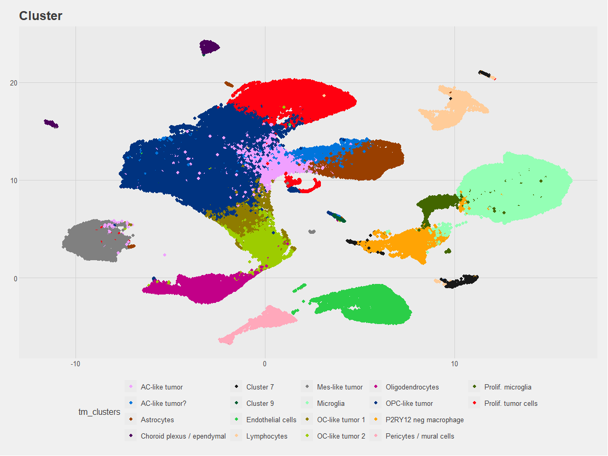<!-- -->

### Figure 2
#### UMAP colored by condition.
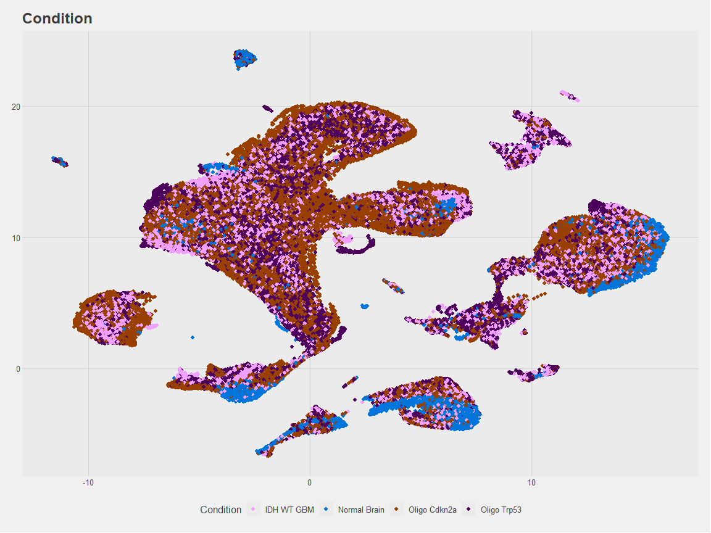<!-- -->

### Figure 3. 
#### Box plot of all clusters divided by condition. Include statistical comparison information.

```
## Performing logit transformation of proportions
```

```
## group variable has > 2 levels, ANOVA will be performed
```

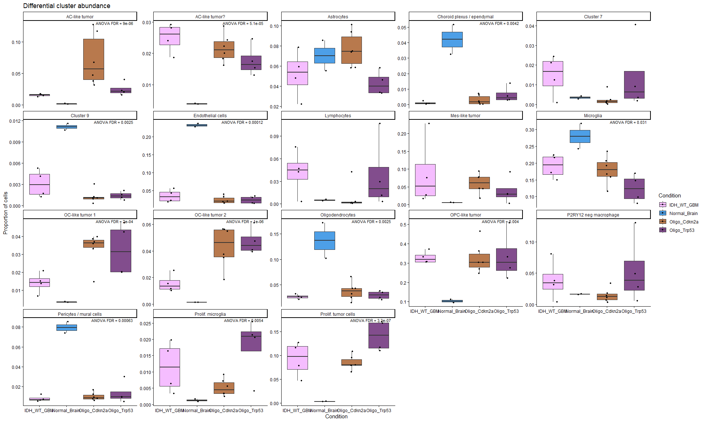<!-- -->

***

## Tumor only
### Figure 4. 
#### UMAP. Reclustering of only tumor cell clusters. Colored by cluster ID.
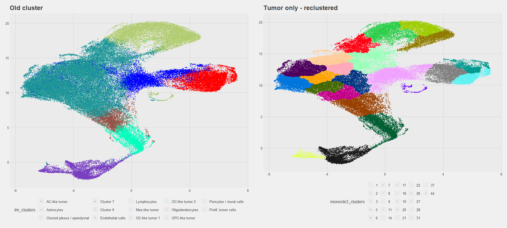<!-- -->

### Split by condition 


## Trajectory inference using Monocle3
### Figure 5. 
#### Pseudotime trajectory analysis of above tumor cell clustering (to define undifferentiated vs differentiated clusters).
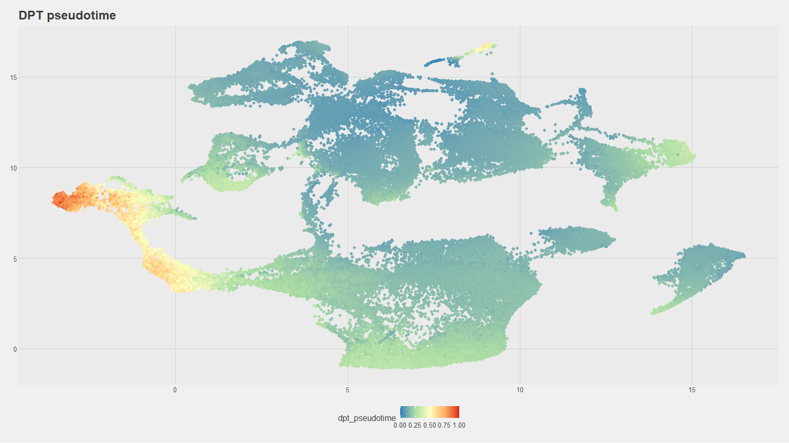<!-- -->

#### Differential expression as a function of pseudotime
##### Used genes with q value < 0.01 differential expression analysis (total n = 14,037) - can use others
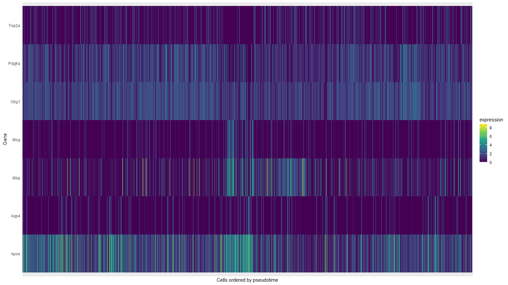<!-- -->

### Figure 6. 
#### Box plot of tumor cell clusters only divided by condition. Include statistical comparison information.

```
## Performing logit transformation of proportions
```

```
## group variable has > 2 levels, ANOVA will be performed
```

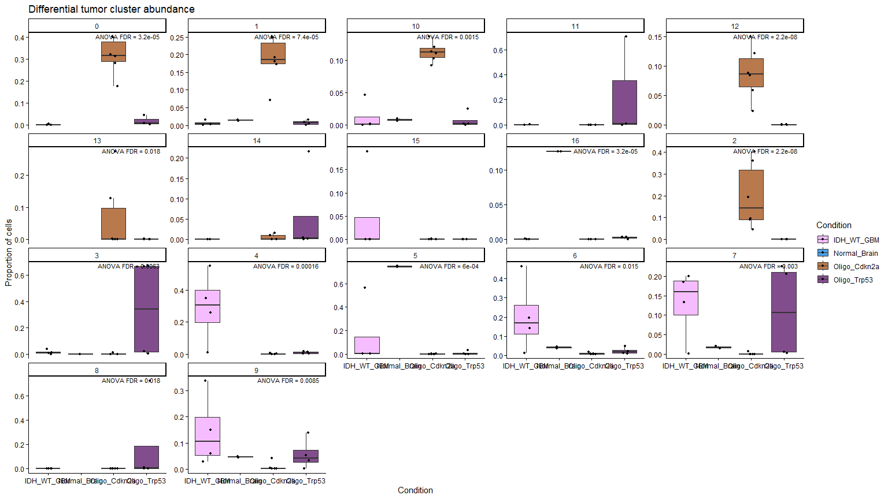<!-- -->

***
## Heatmap
### By cell

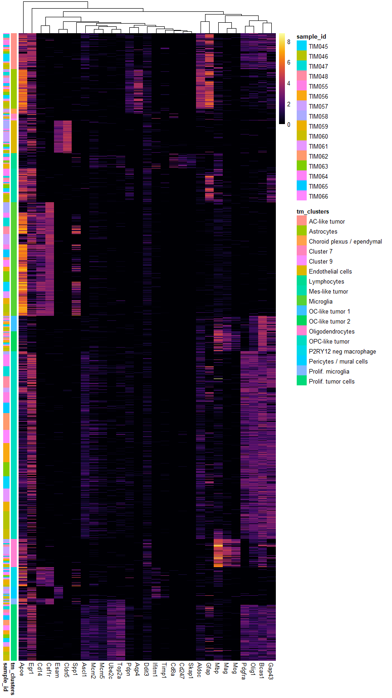<!-- -->

### By cluster
#### Scaled


#### pheatmap

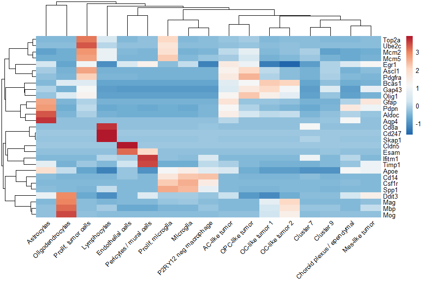<!-- -->
#### Midpoint 0
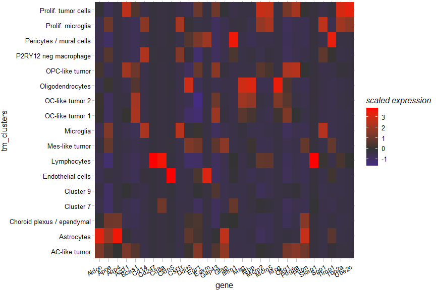<!-- -->

***

## GSEA


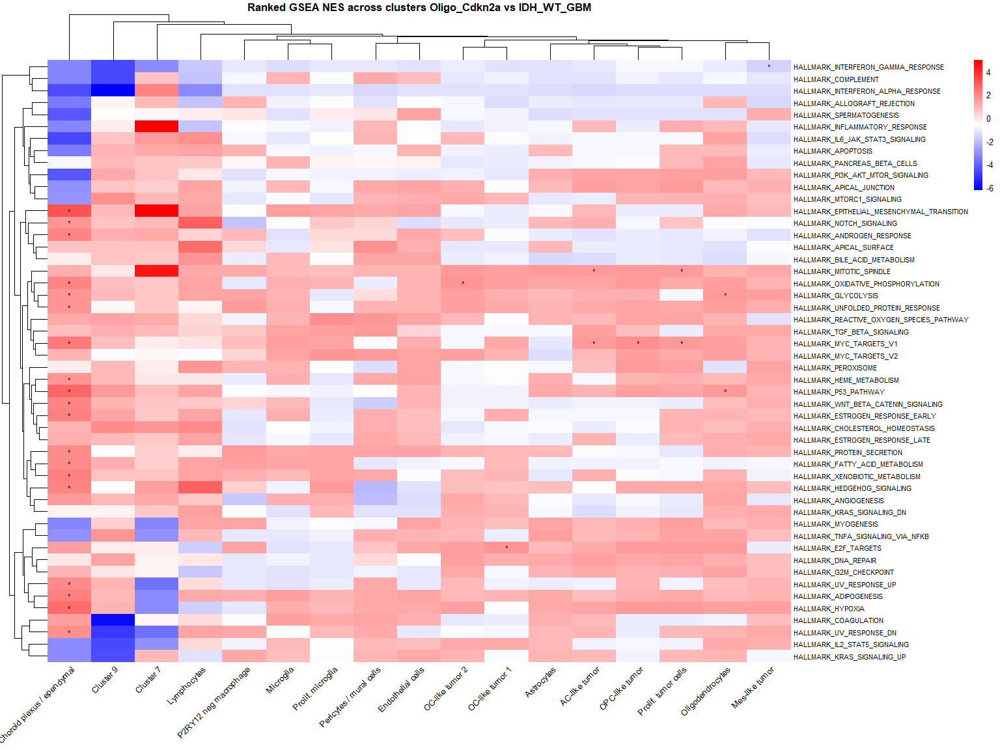<!-- -->

#### Microglia / macrophage differences
##### Oligo Cdkn2a vs normal brain

```
## $plot
```

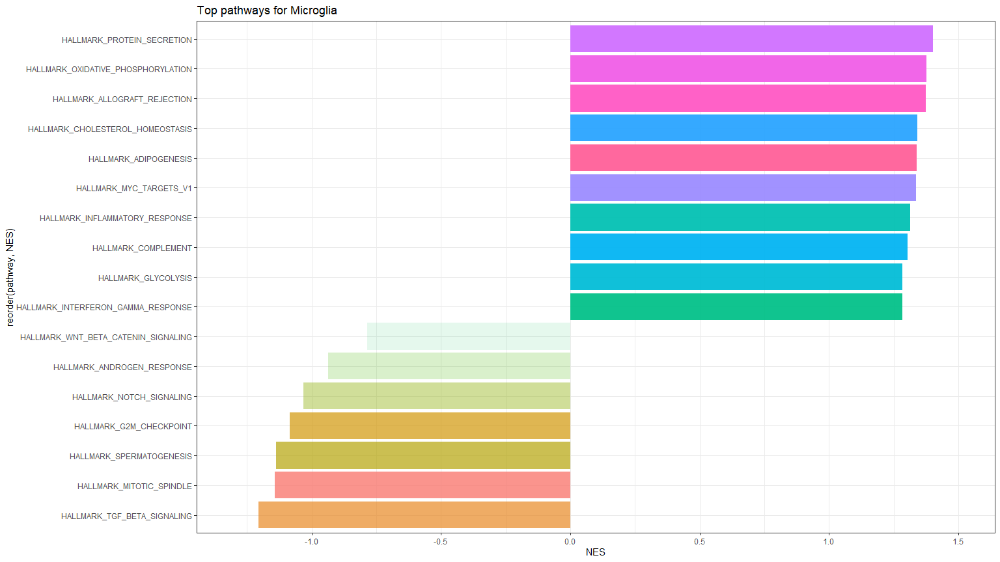<!-- -->

```
## $plot
```

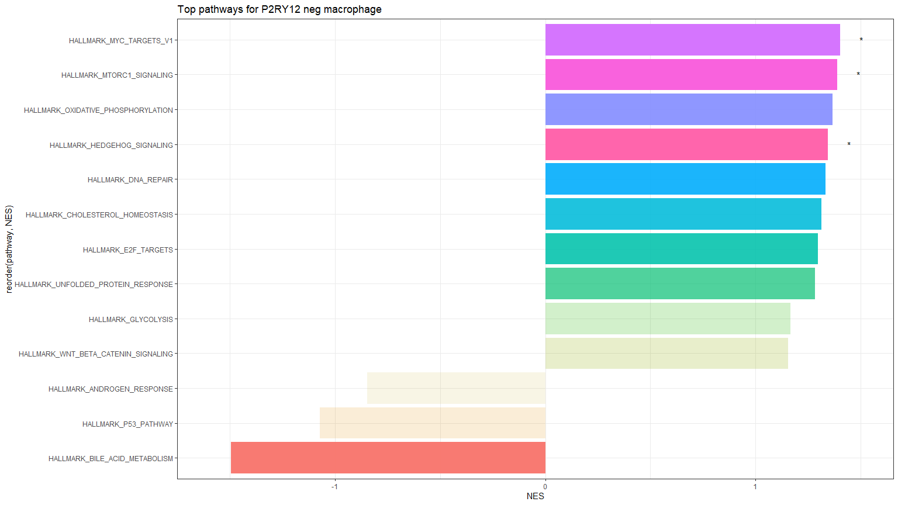<!-- -->

##### Oligo Trp53 vs normal brain

```
## $plot
```

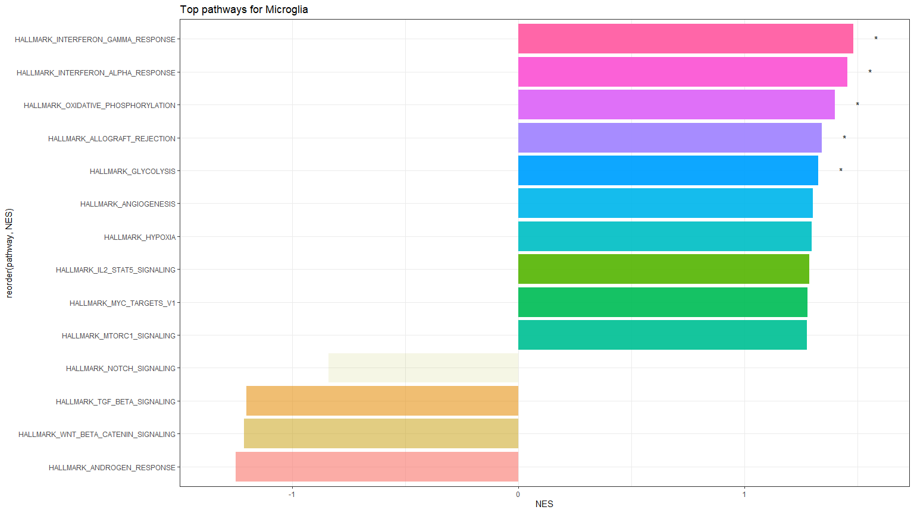<!-- -->

```
## $plot
```

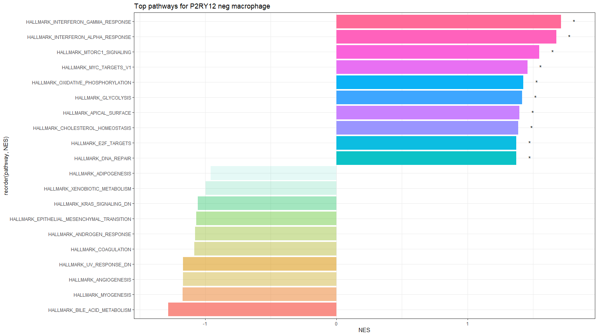<!-- -->

##### IDH WT GBM vs normal brain

```
## $plot
```

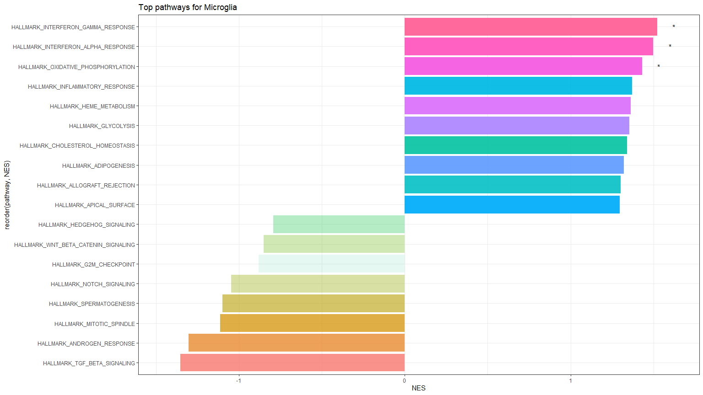<!-- -->

```
## $plot
```

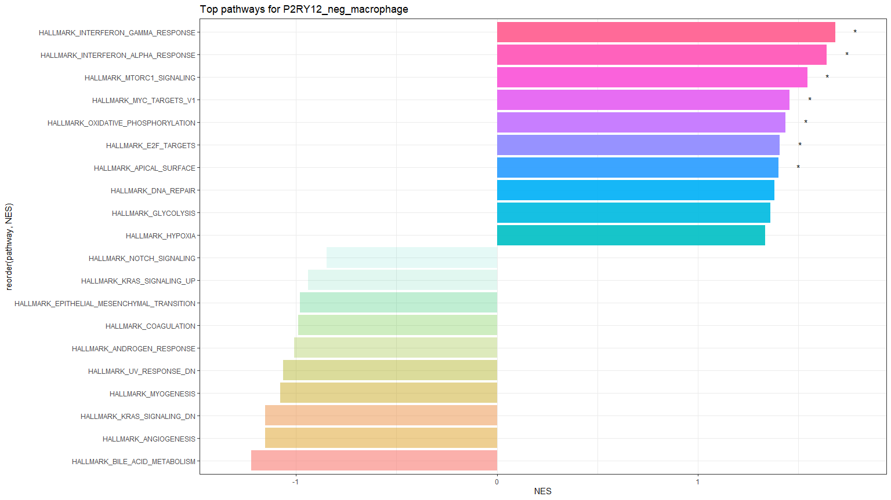<!-- -->

#### Trailmaker QC settings

```
##         classifier                cellSizeDistribution
## TIM055  FDR = 0.01  binStep = 200, minCellSize = 91892
## TIM056  FDR = 0.01  binStep = 200, minCellSize = 88852
## TIM057  FDR = 0.01  binStep = 200, minCellSize = 52661
## TIM058  FDR = 0.01  binStep = 200, minCellSize = 53079
## TIM059  FDR = 0.01 binStep = 200, minCellSize = 151633
## TIM060  FDR = 0.01 binStep = 200, minCellSize = 197965
## TIM061  FDR = 0.01  binStep = 200, minCellSize = 81950
## TIM062  FDR = 0.01  binStep = 200, minCellSize = 81265
## TIM063  FDR = 0.01  binStep = 200, minCellSize = 98004
## TIM064  FDR = 0.01  binStep = 200, minCellSize = 60287
## TIM065  FDR = 0.01  binStep = 200, minCellSize = 96917
## TIM066  FDR = 0.01  binStep = 200, minCellSize = 88152
## TIM045X FDR = 0.01  binStep = 200, minCellSize = 72052
## TIM046X FDR = 0.01  binStep = 200, minCellSize = 75486
## TIM047X FDR = 0.01  binStep = 200, minCellSize = 61277
## TIM048X FDR = 0.01  binStep = 200, minCellSize = 74047
##                                                         mitochondrialContent
## TIM055  method = absoluteThreshold, binStep = 0.3, maxFraction = 0.005938702
## TIM056  method = absoluteThreshold, binStep = 0.3, maxFraction = 0.005417118
## TIM057   method = absoluteThreshold, binStep = 0.3, maxFraction = 0.01593528
## TIM058   method = absoluteThreshold, binStep = 0.3, maxFraction = 0.01356374
## TIM059  method = absoluteThreshold, binStep = 0.3, maxFraction = 0.005409603
## TIM060  method = absoluteThreshold, binStep = 0.3, maxFraction = 0.005328189
## TIM061  method = absoluteThreshold, binStep = 0.3, maxFraction = 0.005609059
## TIM062  method = absoluteThreshold, binStep = 0.3, maxFraction = 0.005952935
## TIM063   method = absoluteThreshold, binStep = 0.3, maxFraction = 0.00520047
## TIM064  method = absoluteThreshold, binStep = 0.3, maxFraction = 0.005415162
## TIM065  method = absoluteThreshold, binStep = 0.3, maxFraction = 0.005557575
## TIM066  method = absoluteThreshold, binStep = 0.3, maxFraction = 0.005331363
## TIM045X method = absoluteThreshold, binStep = 0.3, maxFraction = 0.006008584
## TIM046X method = absoluteThreshold, binStep = 0.3, maxFraction = 0.005730428
## TIM047X method = absoluteThreshold, binStep = 0.3, maxFraction = 0.005298013
## TIM048X method = absoluteThreshold, binStep = 0.3, maxFraction = 0.005293246
##                                        numGenesVsNumUmis
## TIM055   regressionType = spline, p.level = 0.0001132759
## TIM056  regressionType = spline, p.level = 0.00009344048
## TIM057  regressionType = spline, p.level = 0.00009119927
## TIM058    regressionType = spline, p.level = 0.000114771
## TIM059  regressionType = spline, p.level = 0.00008873114
## TIM060   regressionType = spline, p.level = 0.0001004823
## TIM061          regressionType = spline, p.level = 0.001
## TIM062   regressionType = spline, p.level = 0.0001129944
## TIM063  regressionType = spline, p.level = 0.00008002561
## TIM064   regressionType = spline, p.level = 0.0001237777
## TIM065   regressionType = spline, p.level = 0.0001085187
## TIM066  regressionType = spline, p.level = 0.00009521996
## TIM045X regressionType = spline, p.level = 0.00007392076
## TIM046X regressionType = spline, p.level = 0.00007785737
## TIM047X   regressionType = spline, p.level = 0.000101688
## TIM048X  regressionType = spline, p.level = 0.0001007252
##                                            doubletScores
## TIM055  binStep = 0.02, probabilityThreshold = 0.4450093
## TIM056  binStep = 0.02, probabilityThreshold = 0.4237304
## TIM057  binStep = 0.02, probabilityThreshold = 0.4759446
## TIM058  binStep = 0.02, probabilityThreshold = 0.4521705
## TIM059  binStep = 0.02, probabilityThreshold = 0.4872152
## TIM060  binStep = 0.02, probabilityThreshold = 0.3814495
## TIM061  binStep = 0.02, probabilityThreshold = 0.3727773
## TIM062  binStep = 0.02, probabilityThreshold = 0.3910435
## TIM063  binStep = 0.02, probabilityThreshold = 0.4747944
## TIM064  binStep = 0.02, probabilityThreshold = 0.4484248
## TIM065  binStep = 0.02, probabilityThreshold = 0.3973176
## TIM066  binStep = 0.02, probabilityThreshold = 0.4022901
## TIM045X binStep = 0.02, probabilityThreshold = 0.3469654
## TIM046X binStep = 0.02, probabilityThreshold = 0.4371886
## TIM047X  binStep = 0.02, probabilityThreshold = 0.441427
## TIM048X binStep = 0.02, probabilityThreshold = 0.4360736
##                                                                                                            dataIntegration
## TIM055  analysisTool = scanpy, method = harmony, numGenes = 2000, normalisation = logNormalize, method = rpca, numPCs = 30
## TIM056                                                                                                                <NA>
## TIM057                                                                                                                <NA>
## TIM058                                                                                                                <NA>
## TIM059                                                                                                                <NA>
## TIM060                                                                                                                <NA>
## TIM061                                                                                                                <NA>
## TIM062                                                                                                                <NA>
## TIM063                                                                                                                <NA>
## TIM064                                                                                                                <NA>
## TIM065                                                                                                                <NA>
## TIM066                                                                                                                <NA>
## TIM045X                                                                                                               <NA>
## TIM046X                                                                                                               <NA>
## TIM047X                                                                                                               <NA>
## TIM048X                                                                                                               <NA>
##                                                                                       configureEmbedding
## TIM055  method = umap, distanceMetric = cosine, minimumDistance = 0.3, method = leiden, resolution = 0.8
## TIM056                                                                                              <NA>
## TIM057                                                                                              <NA>
## TIM058                                                                                              <NA>
## TIM059                                                                                              <NA>
## TIM060                                                                                              <NA>
## TIM061                                                                                              <NA>
## TIM062                                                                                              <NA>
## TIM063                                                                                              <NA>
## TIM064                                                                                              <NA>
## TIM065                                                                                              <NA>
## TIM066                                                                                              <NA>
## TIM045X                                                                                             <NA>
## TIM046X                                                                                             <NA>
## TIM047X                                                                                             <NA>
## TIM048X                                                                                             <NA>
```

Built with R 4.5.2.
